The Wage Gap Persists: How pay imbalances unequally reward male
professors at the University of Toronto
================
Thomas Rosenthal

March 1, 2021

## Introduction

Academia is increasingly female. Within Canadian institutions of higher
education, gender parity was reached for students in 1989 (Council of
Canadian Academies, 2012). Research in 2012 using Statistics Canada
surveys found that women outnumbered men in both undergraduate and
graduate programs and represented nearly 50% of all PhD students. As
such, staff ratios at universities for both administrator and professor
positions should begin to reach gender parity as qualified women
graduates enter into the workforce. However, simply hiring more women
does not address known wage gaps between genders. Momani et al. found,
“men were paid on average 2.06%, 2.14%, and 5.26% more than their
women colleagues for all employees, university teaching staff, and
deans, respectively” within Ontario higher education from 1996-2016
(2019). Similarly, the CBC reported in 2020 that similar wage gaps
existed in Alberta following preliminary data analysis from Statistics
Canada salary data (Cummings, 2020). The University of Toronto Provost
specifically addressed the gap in 2019, following the university’s
internal salary audits, noting that female faculty were at least 3.9%
underpaid compared to men in similar positions (Benjamin et al. 2019).

This analysis highlights the inequality in both the number of female
staff at the University of Toronto and their lower-than-male salaries
through exploratory data analysis and two Gaussian Bayesian models using
Ontario’s Public Sector Salary Disclosure from 2012-2019 (also known as
“The Sunshine List”). The Sunshine List is available for download
through open data initiatives to disclose the salaries of all public
employees earning more than $100,000 per annum in Ontario. The analysis
examines the effects of gender, title, and years of experience (see
§Dataset). Both exploratory data analysis and Bayesian models found
that female professors and staff are paid less than their male
counterparts with similar titles, and this wage gap is increasingly
worse year over year.

Following context and exploratory data analysis, the first of two models
will consider the entire University of Toronto staff from 2012-2019.
High-level results reveal that women are indeed paid less than men, and
despite increasing female employment each year, the wage gap is
increasing. The second model focuses on the four most common professor
titles in the most recent year (2019). High-level results reveal that
female professors are paid less than male professors, and most full
professor roles are still held by men rather than women.

## Data Exploration

Ontario makes available public sector salary disclosures from 1996-2019
(or most current year) available through the Open Data Ontario portal,
or for each year as a .csv file from
[ontario.ca/page/public-sector-salary-disclosure](https://www.ontario.ca/page/public-sector-salary-disclosure).
Every file is limited to publicly held positions earning greater than
$100,000 per annum.

Eight columns are present throughout: *Sector* and *Employer*, the *Last
Name* and *First Name* of every employee, their corresponding *Salary
Paid* and *Taxable Benefits* amounts, and their *Job Title*. *Calendar
Year* is added as reference to differentiate years from one another.

### Dataset

This analysis is limited from 2012-2019 calendar years to allow for
local processing. The analysis should be reproducible for all years
(1996-Present), though some additional flexibility may be required
during file loading to handle column differences (however, several of
these are already resolved).

**Table 1** exemplifies typical formatting, in this case filtered to
relevant University of Toronto staff (names have been generated for this
purpose to preserve privacy using the `babynames` package (Hadley
Wickham 2019), however job titles and salaries were randomly selected
from all years). Salary Paid columns varied in formatting across years.

<table class="table" style="margin-left: auto; margin-right: auto;">

<caption>

Sample Dataset Rows

</caption>

<thead>

<tr>

<th style="text-align:left;">

Last Name

</th>

<th style="text-align:left;">

First Name

</th>

<th style="text-align:left;">

Salary Paid

</th>

<th style="text-align:left;">

Job Title

</th>

<th style="text-align:right;">

Calendar Year

</th>

</tr>

</thead>

<tbody>

<tr>

<td style="text-align:left;">

Smith

</td>

<td style="text-align:left;">

Karen

</td>

<td style="text-align:left;">

$167,822.46

</td>

<td style="text-align:left;">

Professor of Cell and Systems Biology

</td>

<td style="text-align:right;">

2016

</td>

</tr>

<tr>

<td style="text-align:left;">

Johnson

</td>

<td style="text-align:left;">

Thomas

</td>

<td style="text-align:left;">

$152,060.52

</td>

<td style="text-align:left;">

Professor of Economics

</td>

<td style="text-align:right;">

2017

</td>

</tr>

<tr>

<td style="text-align:left;">

Williams

</td>

<td style="text-align:left;">

Joan

</td>

<td style="text-align:left;">

$ 113,188.39

</td>

<td style="text-align:left;">

Sexual and Gender Diversity Officer

</td>

<td style="text-align:right;">

2018

</td>

</tr>

<tr>

<td style="text-align:left;">

Brown

</td>

<td style="text-align:left;">

Kelly

</td>

<td style="text-align:left;">

$ 109,710.01

</td>

<td style="text-align:left;">

Computer Network Support Specialist

</td>

<td style="text-align:right;">

2018

</td>

</tr>

<tr>

<td style="text-align:left;">

Jones

</td>

<td style="text-align:left;">

Carolyn

</td>

<td style="text-align:left;">

157217.02

</td>

<td style="text-align:left;">

Professor of Anthropology

</td>

<td style="text-align:right;">

2013

</td>

</tr>

<tr>

<td style="text-align:left;">

Miller

</td>

<td style="text-align:left;">

Julie

</td>

<td style="text-align:left;">

$121,197.99

</td>

<td style="text-align:left;">

Director, Office Of The Vice President, International, Government And
Institutional Relations

</td>

<td style="text-align:right;">

2015

</td>

</tr>

</tbody>

</table>

*Table 1*

It is worth noting that Ontario’s public sector salary disclosure does
not separate job titles into positions and corresponding
departments/faculties. Future analysis should consider matching job
titles to a supplementary dataset, rather than relying on text parsing.
As such, this work limits job title to the broadest categories: properly
parsed, Assistant Professor, Associate Professor, Professor, and
Professor and Chair are the most frequently occurring job titles for
each year. Inclusion of “lecturer” titles affects this frequency, where
its prevalence is highly noted in earlier years (for example, it is more
frequent than Assistant Professor in 2012-2014). Variance across years
tends to emerge in less frequent titles, and small inconsistencies in
Job Titles affect the overall precision of these groupings. **Table 2**
represents the top three Job Titles after parsing for each year.

<table class="table" style="margin-left: auto; margin-right: auto;">

<caption>

Three Most Frequent Job Titles by Year

</caption>

<thead>

<tr>

<th style="text-align:left;">

CalendarYear

</th>

<th style="text-align:left;">

JobTitle

</th>

<th style="text-align:right;">

count

</th>

</tr>

</thead>

<tbody>

<tr>

<td style="text-align:left;">

2012

</td>

<td style="text-align:left;">

Professor

</td>

<td style="text-align:right;">

1608

</td>

</tr>

<tr>

<td style="text-align:left;">

2012

</td>

<td style="text-align:left;">

Associate Professor

</td>

<td style="text-align:right;">

130

</td>

</tr>

<tr>

<td style="text-align:left;">

2012

</td>

<td style="text-align:left;">

Assistant Professor

</td>

<td style="text-align:right;">

75

</td>

</tr>

<tr>

<td style="text-align:left;">

2013

</td>

<td style="text-align:left;">

Professor

</td>

<td style="text-align:right;">

1566

</td>

</tr>

<tr>

<td style="text-align:left;">

2013

</td>

<td style="text-align:left;">

Associate Professor

</td>

<td style="text-align:right;">

157

</td>

</tr>

<tr>

<td style="text-align:left;">

2013

</td>

<td style="text-align:left;">

Assistant Professor

</td>

<td style="text-align:right;">

98

</td>

</tr>

<tr>

<td style="text-align:left;">

2014

</td>

<td style="text-align:left;">

Professor

</td>

<td style="text-align:right;">

1562

</td>

</tr>

<tr>

<td style="text-align:left;">

2014

</td>

<td style="text-align:left;">

Associate Professor

</td>

<td style="text-align:right;">

172

</td>

</tr>

<tr>

<td style="text-align:left;">

2014

</td>

<td style="text-align:left;">

Assistant Professor

</td>

<td style="text-align:right;">

99

</td>

</tr>

<tr>

<td style="text-align:left;">

2015

</td>

<td style="text-align:left;">

Professor

</td>

<td style="text-align:right;">

1529

</td>

</tr>

<tr>

<td style="text-align:left;">

2015

</td>

<td style="text-align:left;">

Associate Professor

</td>

<td style="text-align:right;">

286

</td>

</tr>

<tr>

<td style="text-align:left;">

2015

</td>

<td style="text-align:left;">

Assistant Professor

</td>

<td style="text-align:right;">

131

</td>

</tr>

<tr>

<td style="text-align:left;">

2016

</td>

<td style="text-align:left;">

Professor

</td>

<td style="text-align:right;">

1578

</td>

</tr>

<tr>

<td style="text-align:left;">

2016

</td>

<td style="text-align:left;">

Associate Professor

</td>

<td style="text-align:right;">

477

</td>

</tr>

<tr>

<td style="text-align:left;">

2016

</td>

<td style="text-align:left;">

Assistant Professor

</td>

<td style="text-align:right;">

203

</td>

</tr>

<tr>

<td style="text-align:left;">

2017

</td>

<td style="text-align:left;">

Professor

</td>

<td style="text-align:right;">

1589

</td>

</tr>

<tr>

<td style="text-align:left;">

2017

</td>

<td style="text-align:left;">

Associate Professor

</td>

<td style="text-align:right;">

456

</td>

</tr>

<tr>

<td style="text-align:left;">

2017

</td>

<td style="text-align:left;">

Assistant Professor

</td>

<td style="text-align:right;">

247

</td>

</tr>

<tr>

<td style="text-align:left;">

2018

</td>

<td style="text-align:left;">

Professor

</td>

<td style="text-align:right;">

1630

</td>

</tr>

<tr>

<td style="text-align:left;">

2018

</td>

<td style="text-align:left;">

Associate Professor

</td>

<td style="text-align:right;">

451

</td>

</tr>

<tr>

<td style="text-align:left;">

2018

</td>

<td style="text-align:left;">

Assistant Professor

</td>

<td style="text-align:right;">

306

</td>

</tr>

<tr>

<td style="text-align:left;">

2019

</td>

<td style="text-align:left;">

Professor

</td>

<td style="text-align:right;">

1690

</td>

</tr>

<tr>

<td style="text-align:left;">

2019

</td>

<td style="text-align:left;">

Associate Professor

</td>

<td style="text-align:right;">

474

</td>

</tr>

<tr>

<td style="text-align:left;">

2019

</td>

<td style="text-align:left;">

Assistant Professor

</td>

<td style="text-align:right;">

337

</td>

</tr>

</tbody>

</table>

*Table 2*

The variable ‘years’ was added alongside Job Titles to further separate
employees with significant differences in salary but no other observable
differences. Years represents an apparent level of experience by
measuring the number of years a professor has been employed at the
University of Toronto earning at least $100,000. The metric is limited
to the total number of years run during data analysis: in this case,
eight years. Including additional years to the dataset will further
differentiate employees from one another. **Table 3**, limited to full
professors, notes that while minimum values are generally low regardless
of the number of years, median salaries increase as years increase,
ranging from $100,899 to $556,898.

<table class="table" style="margin-left: auto; margin-right: auto;">

<caption>

Professor Salaries by Year, 2019

</caption>

<thead>

<tr>

<th style="text-align:left;">

title

</th>

<th style="text-align:right;">

years

</th>

<th style="text-align:right;">

min

</th>

<th style="text-align:right;">

Q1

</th>

<th style="text-align:right;">

median

</th>

<th style="text-align:right;">

Q3

</th>

<th style="text-align:right;">

max

</th>

</tr>

</thead>

<tbody>

<tr>

<td style="text-align:left;">

Professor

</td>

<td style="text-align:right;">

1

</td>

<td style="text-align:right;">

101296.0

</td>

<td style="text-align:right;">

105632.6

</td>

<td style="text-align:right;">

114178.8

</td>

<td style="text-align:right;">

139112.9

</td>

<td style="text-align:right;">

221683.5

</td>

</tr>

<tr>

<td style="text-align:left;">

Professor

</td>

<td style="text-align:right;">

2

</td>

<td style="text-align:right;">

103200.0

</td>

<td style="text-align:right;">

112238.5

</td>

<td style="text-align:right;">

121670.0

</td>

<td style="text-align:right;">

163855.5

</td>

<td style="text-align:right;">

350359.6

</td>

</tr>

<tr>

<td style="text-align:left;">

Professor

</td>

<td style="text-align:right;">

3

</td>

<td style="text-align:right;">

106342.0

</td>

<td style="text-align:right;">

118049.0

</td>

<td style="text-align:right;">

125206.5

</td>

<td style="text-align:right;">

166006.0

</td>

<td style="text-align:right;">

279921.5

</td>

</tr>

<tr>

<td style="text-align:left;">

Professor

</td>

<td style="text-align:right;">

4

</td>

<td style="text-align:right;">

104262.0

</td>

<td style="text-align:right;">

122577.2

</td>

<td style="text-align:right;">

129548.8

</td>

<td style="text-align:right;">

146503.3

</td>

<td style="text-align:right;">

335710.0

</td>

</tr>

<tr>

<td style="text-align:left;">

Professor

</td>

<td style="text-align:right;">

5

</td>

<td style="text-align:right;">

100899.0

</td>

<td style="text-align:right;">

133837.0

</td>

<td style="text-align:right;">

146798.3

</td>

<td style="text-align:right;">

191694.4

</td>

<td style="text-align:right;">

324202.6

</td>

</tr>

<tr>

<td style="text-align:left;">

Professor

</td>

<td style="text-align:right;">

6

</td>

<td style="text-align:right;">

113319.1

</td>

<td style="text-align:right;">

137398.5

</td>

<td style="text-align:right;">

161751.0

</td>

<td style="text-align:right;">

210611.2

</td>

<td style="text-align:right;">

286556.5

</td>

</tr>

<tr>

<td style="text-align:left;">

Professor

</td>

<td style="text-align:right;">

7

</td>

<td style="text-align:right;">

115447.0

</td>

<td style="text-align:right;">

142181.4

</td>

<td style="text-align:right;">

156236.5

</td>

<td style="text-align:right;">

192008.0

</td>

<td style="text-align:right;">

400431.0

</td>

</tr>

<tr>

<td style="text-align:left;">

Professor

</td>

<td style="text-align:right;">

8

</td>

<td style="text-align:right;">

101897.0

</td>

<td style="text-align:right;">

176188.4

</td>

<td style="text-align:right;">

196171.5

</td>

<td style="text-align:right;">

226845.2

</td>

<td style="text-align:right;">

556898.8

</td>

</tr>

</tbody>

</table>

*Table 3*

### Gender Encoding Process

Ontario’s public sector salary disclosure does not specify “gender”. As
such, gender columns are calculated using the `gender` package (Mullen
2020) and its underlying dataset built from US Census and Social
Security data. The package assigns a male/female label based on the
frequency of male to female name occurrence (whichever is more frequent)
within a specified time period (in this case, 1932-2012, the most recent
period, as it can be safely assumed that nearly all working
professionals will be born within this range). In cases where a name is
not present, no gender is assigned.

There are 4215 distinct first names for University of Toronto staff
between 2012 and 2019. At first pass, the package successfully assigned
2652 first names (63%). Among the unmatched, a highly frequent cause of
non-matches was persons with two first names listed (e.g. Charles
James). These were split, and 837 (53% of unmatched, 20% of total) were
rematched successfully (bringing matched names to 83%). Priority was
given to the first of these two names (i.e. Charles), but some were
matched on the second of these names (i.e. James). The latter was
especially useful for names which had been abbreviated (e.g. C. James).
Similarly, some unmatched names were two hyphenated first names. An
additional 90 were matched in the same manner. Of remaining unmatched
names, a small number (15) were matched on alternative names listed in
parentheses. **Table 4** shows each iteration’s remaining unmatched
assignment. In total, 3604 names were matched (86%). The remaining 14%
are labeled as “unknown” throughout this analysis.

<table class="table" style="margin-left: auto; margin-right: auto;">

<caption>

Gender Encoding Iterations

</caption>

<thead>

<tr>

<th style="text-align:left;">

iteration

</th>

<th style="text-align:left;">

unknown\_names

</th>

</tr>

</thead>

<tbody>

<tr>

<td style="text-align:left;">

Unique Names

</td>

<td style="text-align:left;">

4215

</td>

</tr>

<tr>

<td style="text-align:left;">

First Pass

</td>

<td style="text-align:left;">

1563

</td>

</tr>

<tr>

<td style="text-align:left;">

Two First Names

</td>

<td style="text-align:left;">

726

</td>

</tr>

<tr>

<td style="text-align:left;">

Names in Parentheses

</td>

<td style="text-align:left;">

701

</td>

</tr>

<tr>

<td style="text-align:left;">

Hyphenated First Names

</td>

<td style="text-align:left;">

611

</td>

</tr>

</tbody>

</table>

*Table 4*

This process leaves much to be desired. See §Ethical Considerations for
further discussion and the approach’s ramifications.

### Ethical Considerations

References to “gender” within this paper should be viewed with
skepticism. These references are binary, presumptive, declarative
without recourse, and are much closer in definition to “sex assigned at
birth” than gender identity or expression. Current gender theory treats
gender as a spectrum with nuance far beyond the capabilities of models
presented here. Analytical and model-based research that uses gender as
a primary motivator to answer research questions must acknowledge that
conclusions drawn from binary categorization are prone to
overgeneralization and reinforcement of stereotypes. This does not
wholly invalidate results, but rather asks for them to grow with nuance
and recognize limitations. The following concerns are thus expressed
within this work.

The `gender` package (Mullen 2020) explicitly references several crucial
ethical concerns with its use. Firstly, the use of this package should
be used in aggregate. Secondly, the package’s underlying dataset treats
gender as a binary. Thirdly, the package is likely to misgender
individuals, even those who conform to traditional gender binaries.
Fourthly, the relationship between gender and names has not been and
will not be static, creating ambiguity that is not resolvable without
data outside of the package. Finally, the package should be implemented
only when no other option is realizable. Each of these considerations is
addressed below.

The University of Toronto ranges from 2854 (2012) to 4342 (2019)
employees, which should sufficiently qualify as “in aggregate.” *Table
5* shows employees by year with mean salaries as reference. No
individuals are specifically examined within this dataset. Departments
have been removed from job titles in an attempt to further obfuscate
individuals and instead focus on larger populations and their trends.

<table class="table" style="margin-left: auto; margin-right: auto;">

<caption>

Employees by Year, with Mean Salaries

</caption>

<thead>

<tr>

<th style="text-align:right;">

Calendar Year

</th>

<th style="text-align:right;">

Employees

</th>

<th style="text-align:right;">

mean\_sal

</th>

</tr>

</thead>

<tbody>

<tr>

<td style="text-align:right;">

2012

</td>

<td style="text-align:right;">

2854

</td>

<td style="text-align:right;">

152437.2

</td>

</tr>

<tr>

<td style="text-align:right;">

2013

</td>

<td style="text-align:right;">

3032

</td>

<td style="text-align:right;">

153316.0

</td>

</tr>

<tr>

<td style="text-align:right;">

2014

</td>

<td style="text-align:right;">

3195

</td>

<td style="text-align:right;">

153753.9

</td>

</tr>

<tr>

<td style="text-align:right;">

2015

</td>

<td style="text-align:right;">

3288

</td>

<td style="text-align:right;">

155419.3

</td>

</tr>

<tr>

<td style="text-align:right;">

2016

</td>

<td style="text-align:right;">

3551

</td>

<td style="text-align:right;">

160999.2

</td>

</tr>

<tr>

<td style="text-align:right;">

2017

</td>

<td style="text-align:right;">

3738

</td>

<td style="text-align:right;">

159903.0

</td>

</tr>

<tr>

<td style="text-align:right;">

2018

</td>

<td style="text-align:right;">

4037

</td>

<td style="text-align:right;">

160098.6

</td>

</tr>

<tr>

<td style="text-align:right;">

2019

</td>

<td style="text-align:right;">

4342

</td>

<td style="text-align:right;">

162007.1

</td>

</tr>

</tbody>

</table>

*Table 5*

Models within this dataset leave Unknown gender as a possible outcome,
rather than excluding these individuals entirely from analysis. With
more robust data where gender may be knowable without an encoding
process, models would remain reproducible while including an array of
gender expressions (though the privacy of individuals should be
considered if such an analysis would be done, especially as to whether
or not collecting gender and making it available in openly accessible
datasets is appropriate). Even without a more robust dataset, datasets
that move beyond gender binaries are being incorporated into the
`gender` package (Mullen 2020) to represent a wider spectrum of
potential gender identities. Models would subsequently reflect those
changes.

Reflecting on their own *gender encoding from first names* process three
years prior, Mihaljević et al. detail the effects of misgendering in
statistical studies (2019). Such reductive processes introduce both
statistically significant and socially traditional biases, and as such
“result\[s\] are seldom transparent, reproducible, or transferrable”
(ibid). Gender-based outcome metrics should be viewed as unknowingly
inaccurate unless gender has been volunteered by study subjects.
Mihaljević et al. criticize the perpetuation of traditional binary
approaches as likely to “objectify and justify already existing
inequalities between groups” if “results \[are not\] within the right
context” (ibid). Binary approaches also reject lived experiences of
non-binary persons; Costanza-Chock’s revealing depiction of
\#TravelingWhileTrans exemplifies the erasure of non-binary persons
through statistical oversimplification (2020).

Furthermore, misgendering occurs even for persons who identify as either
male or female. Blevins & Mullen (2015) exemplify this as the “Leslie
Problem” (see **Figure 1**). Historically, Leslie was predominately a
male name in the United States until reaching parity in 1950 and
becoming nearly entirely female by the year 2000. The `gender` package
(Mullen 2020) attempts to counteract this effect by including a date
range; studying historical datasets from the 1800s will as such classify
Leslie as male, rather than female. The Leslie Problem highlights the
likelihood of classifying all instances of a name as the same gender
based on perceived frequency. For names that are near parity, the
`gender` package (ibid) will misgender people half of the time on
average. Conclusions drawn from such inaccuracy are dangerous.

Within this dataset, an examination of a highly ambiguous name J\*\*\*\*
demonstrates the issue; for example, three professors teaching in
2012-2019 are gendered as “female” but manual review of faculty profiles
suggests two of these three are much more likely to be “male”. Even if
provided with birth years, this misgendering is unlikely to be resolved
(the example name becomes equally male:female between 1975 and 1980,
before becoming considerably more male by 2000). The rate at which this
occurs across the entire dataset is unknown. The example name J\*\*\*\*
varies greatly in gender frequency by cultural origin. In the
Netherlands, Catalonia, and Norway the name has been one of the most
popular (if not the most popular) “male” first names. The `gender`
package (Mullen 2020) by contrast, is based solely on US data, where
J\*\*\*\* popularity and gender frequency have varied. As such, the
encoding process erases any cultural nuance, even when it might be
otherwise interpretable by last names.

Logically, it should be realized that using a predominately US data
source will outright exclude many common names found in other countries
and languages, especially those of non-European origin. Any effort made
by the university to hire from a diverse set of professors and
applicants, especially within the context of the city of Toronto’s
highly diverse demographics, is immediately erased by statistical
analyses here. This gender encoding process punishes diversity, pushing
all unmatched names into an “unknown” categorization from which
coefficients are drawn. The unknown category is assumed to be both male
and female—as such, high-paying salaries for female staff who are
unmatched by the gender encoding process are not adequately captured in
exploratory data analysis or modelling. Efforts to become more inclusive
in hiring are thus hampered by such crude gender proxies.

Furthermore, it is unknown how Ontario (or the University of Toronto)
handles further nuance in names. Conforming to a “First Name Last Name”
Western standard may already reduce the complexity in naming that is
found throughout the world. The effect of this cultural bias on the data
is noticeable for first names that have an added name in parentheses.
Though these instances were not highly frequent, names within
parentheses were nearly always Anglo-Saxon in origin. Whether these
parentheticals were voluntarily provided to the public salary disclosure
or not is unknown.

A logical question drawn from these ethical concerns is whether or not
this analysis should be done at all. While the complexity of this
problem is by no means fully captured, subset populations examined
manually where gender was known (either through personal interaction
with these professors or through their work, faculty pages, video
introductions, and/or pronoun usage) showed similar male:female
inequality in salaries at the University of Toronto. The university’s
status as a “leading institution” in Canada and its highly regarded
reputation elsewhere in the world warrants a critical eye. With
consideration of the Provost’s announcement that female faculty would be
equally compensated (Benjamin, et al. 2019), it is paramount to design a
statistical study that can externally validate these results and be
reproducible in order to encourage conversations as to whether or not
the university is addressing these inequities in a fair and timely
manner.

### Exploratory Results

Following the gender encoding process, summarized counts and
corresponding salary data is presented in **Table 6**. With significant
outliers removed, **Plot 1** shows the general upward increase over time
for male salaries but may also be misleading, as the number of female
employees has been increasing at a faster rate, as shown in **Table 7**.
Combined with lower mean salaries and a much lower upper quartile,
increases in female salaries for existing versus new employees are
harder to estimate.

<table class="table" style="margin-left: auto; margin-right: auto;">

<caption>

Salaries by Gender (all years, all positions)

</caption>

<thead>

<tr>

<th style="text-align:left;">

gender

</th>

<th style="text-align:right;">

count

</th>

<th style="text-align:right;">

mean

</th>

<th style="text-align:right;">

max

</th>

</tr>

</thead>

<tbody>

<tr>

<td style="text-align:left;">

female

</td>

<td style="text-align:right;">

11003

</td>

<td style="text-align:right;">

147492.2

</td>

<td style="text-align:right;">

499678.8

</td>

</tr>

<tr>

<td style="text-align:left;">

male

</td>

<td style="text-align:right;">

15156

</td>

<td style="text-align:right;">

165157.9

</td>

<td style="text-align:right;">

1473446.0

</td>

</tr>

<tr>

<td style="text-align:left;">

unknown

</td>

<td style="text-align:right;">

1878

</td>

<td style="text-align:right;">

157274.3

</td>

<td style="text-align:right;">

498730.0

</td>

</tr>

</tbody>

</table>

*Table 6*

<!-- -->

*Plot 1*

<table class="table" style="margin-left: auto; margin-right: auto;">

<caption>

YoY pct change by Gender 2012-2019

</caption>

<thead>

<tr>

<th style="text-align:left;">

gender

</th>

<th style="text-align:left;">

CalendarYear

</th>

<th style="text-align:right;">

count

</th>

<th style="text-align:right;">

pct\_change

</th>

</tr>

</thead>

<tbody>

<tr>

<td style="text-align:left;">

female

</td>

<td style="text-align:left;">

2012

</td>

<td style="text-align:right;">

1048

</td>

<td style="text-align:right;">

NA

</td>

</tr>

<tr>

<td style="text-align:left;">

female

</td>

<td style="text-align:left;">

2013

</td>

<td style="text-align:right;">

1153

</td>

<td style="text-align:right;">

10.0190840

</td>

</tr>

<tr>

<td style="text-align:left;">

female

</td>

<td style="text-align:left;">

2014

</td>

<td style="text-align:right;">

1225

</td>

<td style="text-align:right;">

6.2445794

</td>

</tr>

<tr>

<td style="text-align:left;">

female

</td>

<td style="text-align:left;">

2015

</td>

<td style="text-align:right;">

1255

</td>

<td style="text-align:right;">

2.4489796

</td>

</tr>

<tr>

<td style="text-align:left;">

female

</td>

<td style="text-align:left;">

2016

</td>

<td style="text-align:right;">

1388

</td>

<td style="text-align:right;">

10.5976096

</td>

</tr>

<tr>

<td style="text-align:left;">

female

</td>

<td style="text-align:left;">

2017

</td>

<td style="text-align:right;">

1492

</td>

<td style="text-align:right;">

7.4927954

</td>

</tr>

<tr>

<td style="text-align:left;">

female

</td>

<td style="text-align:left;">

2018

</td>

<td style="text-align:right;">

1635

</td>

<td style="text-align:right;">

9.5844504

</td>

</tr>

<tr>

<td style="text-align:left;">

female

</td>

<td style="text-align:left;">

2019

</td>

<td style="text-align:right;">

1807

</td>

<td style="text-align:right;">

10.5198777

</td>

</tr>

<tr>

<td style="text-align:left;">

male

</td>

<td style="text-align:left;">

2012

</td>

<td style="text-align:right;">

1602

</td>

<td style="text-align:right;">

NA

</td>

</tr>

<tr>

<td style="text-align:left;">

male

</td>

<td style="text-align:left;">

2013

</td>

<td style="text-align:right;">

1698

</td>

<td style="text-align:right;">

5.9925094

</td>

</tr>

<tr>

<td style="text-align:left;">

male

</td>

<td style="text-align:left;">

2014

</td>

<td style="text-align:right;">

1773

</td>

<td style="text-align:right;">

4.4169611

</td>

</tr>

<tr>

<td style="text-align:left;">

male

</td>

<td style="text-align:left;">

2015

</td>

<td style="text-align:right;">

1835

</td>

<td style="text-align:right;">

3.4968979

</td>

</tr>

<tr>

<td style="text-align:left;">

male

</td>

<td style="text-align:left;">

2016

</td>

<td style="text-align:right;">

1933

</td>

<td style="text-align:right;">

5.3405995

</td>

</tr>

<tr>

<td style="text-align:left;">

male

</td>

<td style="text-align:left;">

2017

</td>

<td style="text-align:right;">

1996

</td>

<td style="text-align:right;">

3.2591826

</td>

</tr>

<tr>

<td style="text-align:left;">

male

</td>

<td style="text-align:left;">

2018

</td>

<td style="text-align:right;">

2113

</td>

<td style="text-align:right;">

5.8617234

</td>

</tr>

<tr>

<td style="text-align:left;">

male

</td>

<td style="text-align:left;">

2019

</td>

<td style="text-align:right;">

2206

</td>

<td style="text-align:right;">

4.4013251

</td>

</tr>

<tr>

<td style="text-align:left;">

unknown

</td>

<td style="text-align:left;">

2012

</td>

<td style="text-align:right;">

204

</td>

<td style="text-align:right;">

NA

</td>

</tr>

<tr>

<td style="text-align:left;">

unknown

</td>

<td style="text-align:left;">

2013

</td>

<td style="text-align:right;">

181

</td>

<td style="text-align:right;">

\-11.2745098

</td>

</tr>

<tr>

<td style="text-align:left;">

unknown

</td>

<td style="text-align:left;">

2014

</td>

<td style="text-align:right;">

197

</td>

<td style="text-align:right;">

8.8397790

</td>

</tr>

<tr>

<td style="text-align:left;">

unknown

</td>

<td style="text-align:left;">

2015

</td>

<td style="text-align:right;">

198

</td>

<td style="text-align:right;">

0.5076142

</td>

</tr>

<tr>

<td style="text-align:left;">

unknown

</td>

<td style="text-align:left;">

2016

</td>

<td style="text-align:right;">

230

</td>

<td style="text-align:right;">

16.1616162

</td>

</tr>

<tr>

<td style="text-align:left;">

unknown

</td>

<td style="text-align:left;">

2017

</td>

<td style="text-align:right;">

250

</td>

<td style="text-align:right;">

8.6956522

</td>

</tr>

<tr>

<td style="text-align:left;">

unknown

</td>

<td style="text-align:left;">

2018

</td>

<td style="text-align:right;">

289

</td>

<td style="text-align:right;">

15.6000000

</td>

</tr>

<tr>

<td style="text-align:left;">

unknown

</td>

<td style="text-align:left;">

2019

</td>

<td style="text-align:right;">

329

</td>

<td style="text-align:right;">

13.8408304

</td>

</tr>

</tbody>

</table>

*Table 7*

When limited strictly to Job Titles matching “Professor”, male boxplots
are nearly always higher (**Plot 2**). Of the three most common titles,
(Assistant Professor, Associate Professor, and Professor) male
professors earn more at median levels, more at lower quartile levels,
and more at upper quartile levels. While the minimum for all titles
within the dataset is $100,000, it is not known how many professors are
under this threshold, or their gender breakdowns. Less frequent titles
rarely result in higher salaries for females over their male
counterparts, and the frequency of females in these roles is
considerably less. Significant outliers are noticeable for male
professors. Maximum salaries for males are significantly higher.

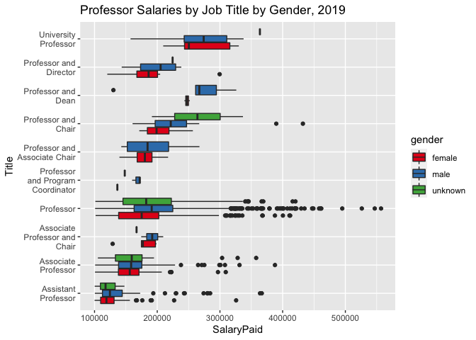<!-- -->

*Plot 2*

Within the context of this exploratory analysis, it is important to
emphasize that the bulk of salaries for all genders occur between
$100,000 and $200,000. **Plot 3** demonstrates the overlapping densities
of all genders. Female employees make the minimum $100,00 more than any
other gender and peak near $110,000 before sharply declining. Compared
to male employees, female employees rarely make more than $200,000. Male
employees also peak near $110,000 but also experience a secondary peak
above $150,000. Additionally, very few females make $300,000 or above;
male employees by contrast continue to see salaries up to $400,000
before becoming significant outliers. Absolute maximum salaries for
employees as referenced in **Table 6** show that males continue to earn
well beyond $500,000, even if extremely rarely. No female or unknown
gender employee makes more than $500,000 for any year or any position in
this dataset.

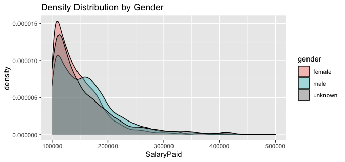<!-- -->

*Plot 3*

## Models

A Bayesian approach allows us to make inferences about the values of our
parameters (such as gender and salary values). Following Gabry &
Goodrich’s (2020) processes outlined for Bayesian analysis using the
`rstanarm` package (Brilleman et al., n.d.), two Gaussian models were
built to examine relationships between Salary Paid and explanatory
variables including gender, calendar year, job title, and years of
experience. The first model focuses on all University of Toronto
employees, whereas the latter is limited to the four most common job
titles containing “Professor” and is limited to 2019. Both models are
compared across their iterations with leave-one-out (LOO)
cross-validation. For both models, default priors were used. For both
models, attempts to predict from the posterior distribution were
unsuccessful. Lack of informative prior selection and predictions made
are a significant limitation of this work, which is otherwise
explanatory.

### Model 1

Model 1 begins with salary paid (in 100s of dollars) as a function of
gender:

\])

Model 1 is then updated to include calendar year:

\[y_i \sim N(\beta_0 + \beta_1 x_i, + \beta_2 z_i, \sigma^2)\]

Final updates to Model 1 add years of
experience:

\[y_i \sim N(\beta_0 + \beta_1 x_i, + \beta_2 z_i + \beta_3 a_i, \sigma^2)\]

  - \(y_i\) is salary paid (in 100s of dollars)
  - \(x_i\) is gender (as female, male, unknown)
  - \(z_i\) is calendar year (2012-2019)
  - \(a_i\) is years of experience (1-8)

### Model 2

Model 2 begins with salary paid (in 100s of dollars) as a function of
gender:

\[y_i \sim N(\beta_0 + \beta_1 x_i, \sigma^2)\]

where
\(\mathcal{D_{t = \tau}} \subset \mathcal{D} = \{ \mathbf{x}_{i, t} \mid t = \tau \}\)
denotes the subset of all rows taken at time \(\tau\).

Model 2 is then updated to include job title:

\[y_i \sim N(\beta_0 + \beta_1 x_i, + \beta_2 z_i, \sigma^2)\]

Final updates to Model 2 add years of
experience:

\[y_i \sim N(\beta_0 + \beta_1 x_i, + \beta_2 z_i + \beta_3 a_i, \sigma^2)\]

  - \(y_i\) is salary paid (in 100s of dollars)
  - \(x_i\) is gender (as female, male, unknown)
  - \(z_i\) is job title (as Assistant Professor, Associate Professor,
    Professor, Professor and Chair)
  - \(a_i\) is years of experience (1-8)
  - \(\tau\) = 2019

## Results

### Model 1

At its simplest, Model 1 considers gender’s effect on salary paid (in
100s of dollars) for the entire University of Toronto dataset.
Exploratory data analysis (**Table 6**) shows that average salaries are
higher for males than females at the same rate as the model (**Table
8**). Mean Post Posterior Distribution is within 100 of the intercept
mean. Rhat scores of 1.0 indicate that convergence from chains was
successful. This is a stable first model to iterate on.

<table class="table" style="margin-left: auto; margin-right: auto;">

<caption>

Model 1, Iteration 1

</caption>

<thead>

<tr>

<th style="text-align:left;">

</th>

<th style="text-align:right;">

mean

</th>

<th style="text-align:right;">

mcse

</th>

<th style="text-align:right;">

sd

</th>

<th style="text-align:right;">

10%

</th>

<th style="text-align:right;">

50%

</th>

<th style="text-align:right;">

90%

</th>

<th style="text-align:right;">

n\_eff

</th>

<th style="text-align:right;">

Rhat

</th>

</tr>

</thead>

<tbody>

<tr>

<td style="text-align:left;">

(Intercept)

</td>

<td style="text-align:right;">

1475.28514

</td>

<td style="text-align:right;">

0.0856294

</td>

<td style="text-align:right;">

5.255904

</td>

<td style="text-align:right;">

1468.66330

</td>

<td style="text-align:right;">

1475.24093

</td>

<td style="text-align:right;">

1481.9380

</td>

<td style="text-align:right;">

3767

</td>

<td style="text-align:right;">

1.0000872

</td>

</tr>

<tr>

<td style="text-align:left;">

gendermale

</td>

<td style="text-align:right;">

175.23454

</td>

<td style="text-align:right;">

0.1035258

</td>

<td style="text-align:right;">

6.970298

</td>

<td style="text-align:right;">

166.30404

</td>

<td style="text-align:right;">

175.27301

</td>

<td style="text-align:right;">

184.2323

</td>

<td style="text-align:right;">

4533

</td>

<td style="text-align:right;">

0.9995185

</td>

</tr>

<tr>

<td style="text-align:left;">

genderunknown

</td>

<td style="text-align:right;">

96.54992

</td>

<td style="text-align:right;">

0.2108575

</td>

<td style="text-align:right;">

13.579665

</td>

<td style="text-align:right;">

79.08309

</td>

<td style="text-align:right;">

96.45908

</td>

<td style="text-align:right;">

114.0169

</td>

<td style="text-align:right;">

4148

</td>

<td style="text-align:right;">

1.0000211

</td>

</tr>

<tr>

<td style="text-align:left;">

sigma

</td>

<td style="text-align:right;">

549.17926

</td>

<td style="text-align:right;">

0.0331052

</td>

<td style="text-align:right;">

2.374545

</td>

<td style="text-align:right;">

546.11694

</td>

<td style="text-align:right;">

549.20357

</td>

<td style="text-align:right;">

552.2032

</td>

<td style="text-align:right;">

5145

</td>

<td style="text-align:right;">

0.9995601

</td>

</tr>

<tr>

<td style="text-align:left;">

mean\_PPD

</td>

<td style="text-align:right;">

1576.18917

</td>

<td style="text-align:right;">

0.0752473

</td>

<td style="text-align:right;">

4.602901

</td>

<td style="text-align:right;">

1570.28463

</td>

<td style="text-align:right;">

1576.15354

</td>

<td style="text-align:right;">

1582.1269

</td>

<td style="text-align:right;">

3742

</td>

<td style="text-align:right;">

0.9996821

</td>

</tr>

<tr>

<td style="text-align:left;">

log-posterior

</td>

<td style="text-align:right;">

\-212488.96493

</td>

<td style="text-align:right;">

0.0338005

</td>

<td style="text-align:right;">

1.417476

</td>

<td style="text-align:right;">

\-212490.86645

</td>

<td style="text-align:right;">

\-212488.64969

</td>

<td style="text-align:right;">

\-212487.4985

</td>

<td style="text-align:right;">

1759

</td>

<td style="text-align:right;">

1.0012838

</td>

</tr>

</tbody>

</table>

*Table 8*

As such, relative to female salaries, **Plot 4** AB lines show
coefficients with greater intercepts for male and unknown gender
employees. Standard deviation is higher for unknown than male genders.

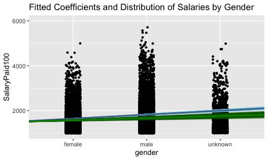<!-- -->

*Plot 4*

At second iteration, the addition of calendar year is more revealing
(**Table 9**). While male and unknown salaries are higher to nearly the
same degree as the previous model, salaries as a whole have increased
substantially in recent years. Estimates for earlier years show that
salaries were increasing at much slower rates. Mean Post Posterior
Distribution is again near to the intercept mean, and Rhat scores of 1.0
indicate that convergence from chains was successful. Monte Carlo
standard errors are higher than the previous iteration.

<table class="table" style="margin-left: auto; margin-right: auto;">

<caption>

Model 1, Iteration 2

</caption>

<thead>

<tr>

<th style="text-align:left;">

</th>

<th style="text-align:right;">

mean

</th>

<th style="text-align:right;">

mcse

</th>

<th style="text-align:right;">

sd

</th>

<th style="text-align:right;">

10%

</th>

<th style="text-align:right;">

50%

</th>

<th style="text-align:right;">

90%

</th>

<th style="text-align:right;">

n\_eff

</th>

<th style="text-align:right;">

Rhat

</th>

</tr>

</thead>

<tbody>

<tr>

<td style="text-align:left;">

(Intercept)

</td>

<td style="text-align:right;">

1416.503669

</td>

<td style="text-align:right;">

0.3122675

</td>

<td style="text-align:right;">

10.705459

</td>

<td style="text-align:right;">

1402.581989

</td>

<td style="text-align:right;">

1416.666888

</td>

<td style="text-align:right;">

1430.13995

</td>

<td style="text-align:right;">

1175

</td>

<td style="text-align:right;">

1.0005621

</td>

</tr>

<tr>

<td style="text-align:left;">

gendermale

</td>

<td style="text-align:right;">

177.765268

</td>

<td style="text-align:right;">

0.1122323

</td>

<td style="text-align:right;">

6.904364

</td>

<td style="text-align:right;">

168.974665

</td>

<td style="text-align:right;">

177.753249

</td>

<td style="text-align:right;">

186.70093

</td>

<td style="text-align:right;">

3785

</td>

<td style="text-align:right;">

0.9996791

</td>

</tr>

<tr>

<td style="text-align:left;">

genderunknown

</td>

<td style="text-align:right;">

95.480924

</td>

<td style="text-align:right;">

0.2450486

</td>

<td style="text-align:right;">

13.574825

</td>

<td style="text-align:right;">

78.281753

</td>

<td style="text-align:right;">

95.613012

</td>

<td style="text-align:right;">

112.66700

</td>

<td style="text-align:right;">

3069

</td>

<td style="text-align:right;">

0.9999721

</td>

</tr>

<tr>

<td style="text-align:left;">

CalendarYear2013

</td>

<td style="text-align:right;">

9.963412

</td>

<td style="text-align:right;">

0.3570598

</td>

<td style="text-align:right;">

13.933475

</td>

<td style="text-align:right;">

\-7.968252

</td>

<td style="text-align:right;">

9.886253

</td>

<td style="text-align:right;">

28.10716

</td>

<td style="text-align:right;">

1523

</td>

<td style="text-align:right;">

0.9997908

</td>

</tr>

<tr>

<td style="text-align:left;">

CalendarYear2014

</td>

<td style="text-align:right;">

14.894387

</td>

<td style="text-align:right;">

0.3559565

</td>

<td style="text-align:right;">

13.802155

</td>

<td style="text-align:right;">

\-2.881960

</td>

<td style="text-align:right;">

14.982724

</td>

<td style="text-align:right;">

32.76914

</td>

<td style="text-align:right;">

1503

</td>

<td style="text-align:right;">

1.0003544

</td>

</tr>

<tr>

<td style="text-align:left;">

CalendarYear2015

</td>

<td style="text-align:right;">

31.304623

</td>

<td style="text-align:right;">

0.3385334

</td>

<td style="text-align:right;">

13.612404

</td>

<td style="text-align:right;">

14.050544

</td>

<td style="text-align:right;">

31.178339

</td>

<td style="text-align:right;">

48.69293

</td>

<td style="text-align:right;">

1617

</td>

<td style="text-align:right;">

1.0003173

</td>

</tr>

<tr>

<td style="text-align:left;">

CalendarYear2016

</td>

<td style="text-align:right;">

89.503235

</td>

<td style="text-align:right;">

0.3593502

</td>

<td style="text-align:right;">

13.289309

</td>

<td style="text-align:right;">

72.813192

</td>

<td style="text-align:right;">

89.505294

</td>

<td style="text-align:right;">

106.73753

</td>

<td style="text-align:right;">

1368

</td>

<td style="text-align:right;">

1.0003853

</td>

</tr>

<tr>

<td style="text-align:left;">

CalendarYear2017

</td>

<td style="text-align:right;">

82.364485

</td>

<td style="text-align:right;">

0.3453372

</td>

<td style="text-align:right;">

13.291794

</td>

<td style="text-align:right;">

65.391981

</td>

<td style="text-align:right;">

82.335728

</td>

<td style="text-align:right;">

99.40592

</td>

<td style="text-align:right;">

1481

</td>

<td style="text-align:right;">

1.0004040

</td>

</tr>

<tr>

<td style="text-align:left;">

CalendarYear2018

</td>

<td style="text-align:right;">

83.935744

</td>

<td style="text-align:right;">

0.3408902

</td>

<td style="text-align:right;">

12.948969

</td>

<td style="text-align:right;">

67.444044

</td>

<td style="text-align:right;">

83.857761

</td>

<td style="text-align:right;">

100.46264

</td>

<td style="text-align:right;">

1443

</td>

<td style="text-align:right;">

1.0004421

</td>

</tr>

<tr>

<td style="text-align:left;">

CalendarYear2019

</td>

<td style="text-align:right;">

105.589367

</td>

<td style="text-align:right;">

0.3238448

</td>

<td style="text-align:right;">

12.904214

</td>

<td style="text-align:right;">

89.257047

</td>

<td style="text-align:right;">

105.331844

</td>

<td style="text-align:right;">

122.15940

</td>

<td style="text-align:right;">

1588

</td>

<td style="text-align:right;">

1.0004603

</td>

</tr>

<tr>

<td style="text-align:left;">

sigma

</td>

<td style="text-align:right;">

547.767424

</td>

<td style="text-align:right;">

0.0355160

</td>

<td style="text-align:right;">

2.339049

</td>

<td style="text-align:right;">

544.788398

</td>

<td style="text-align:right;">

547.747286

</td>

<td style="text-align:right;">

550.80975

</td>

<td style="text-align:right;">

4337

</td>

<td style="text-align:right;">

0.9995529

</td>

</tr>

<tr>

<td style="text-align:left;">

mean\_PPD

</td>

<td style="text-align:right;">

1576.145750

</td>

<td style="text-align:right;">

0.0792738

</td>

<td style="text-align:right;">

4.679392

</td>

<td style="text-align:right;">

1570.161485

</td>

<td style="text-align:right;">

1576.229695

</td>

<td style="text-align:right;">

1582.13064

</td>

<td style="text-align:right;">

3484

</td>

<td style="text-align:right;">

0.9995196

</td>

</tr>

<tr>

<td style="text-align:left;">

log-posterior

</td>

<td style="text-align:right;">

\-212428.267408

</td>

<td style="text-align:right;">

0.0529393

</td>

<td style="text-align:right;">

2.249289

</td>

<td style="text-align:right;">

\-212431.150226

</td>

<td style="text-align:right;">

\-212427.947795

</td>

<td style="text-align:right;">

\-212425.68249

</td>

<td style="text-align:right;">

1805

</td>

<td style="text-align:right;">

1.0021615

</td>

</tr>

</tbody>

</table>

*Table 9*

**Plot 5** shows far fewer female employees making more than $200,000 in
a year. Additionally, the number of female employees hired in recent
years has increased, but they appear to be clustered towards the minimum
$100,000 threshold (the degree at which this is occurring is presented
in **Table 7**). The concentration of higher-paid males is obvious for
all years; significantly more males make more than AB line coefficients
than females. Male salaries have accelerated slightly faster from
2012-2019 than female and unknown gender salaries. Note the reduced
y-axis to better show AB lines, which are otherwise highly overlapped
and difficult to differentiate.

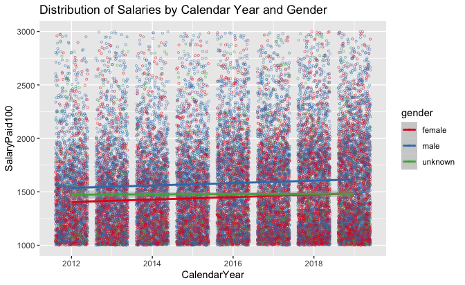<!-- -->

*Plot 5*

In its final iteration, the addition of years of experience is both
useful and slightly confounding. A clear connection to salary and years
exists, but calendar year coefficients are drastically changed from the
previous model (**Table 10**). This is certainly due to the lack of
variety in year values in earlier calendar years (in 2012, the maximum
year value would be one, because no other data to measure from was
present in the analysis). As the relationship between years and salary
is evident, it is apparent that the inclusion of further years would
prove useful. Mean Post Posterior Distribution is much further from the
intercept mean (nearly double), as the intercept mean has decreased
significantly (and is now below the $100,000 threshold). Rhat scores of
1.0 indicate that convergence from chains was successful. Monte Carlo
standard errors are lower than the previous iteration, but still high
for calendar year variables.

<table class="table" style="margin-left: auto; margin-right: auto;">

<caption>

Model 1, Iteration 3

</caption>

<thead>

<tr>

<th style="text-align:left;">

</th>

<th style="text-align:right;">

mean

</th>

<th style="text-align:right;">

mcse

</th>

<th style="text-align:right;">

sd

</th>

<th style="text-align:right;">

10%

</th>

<th style="text-align:right;">

50%

</th>

<th style="text-align:right;">

90%

</th>

<th style="text-align:right;">

n\_eff

</th>

<th style="text-align:right;">

Rhat

</th>

</tr>

</thead>

<tbody>

<tr>

<td style="text-align:left;">

(Intercept)

</td>

<td style="text-align:right;">

766.539109

</td>

<td style="text-align:right;">

0.3410937

</td>

<td style="text-align:right;">

13.725332

</td>

<td style="text-align:right;">

749.04916

</td>

<td style="text-align:right;">

766.533780

</td>

<td style="text-align:right;">

784.311633

</td>

<td style="text-align:right;">

1619

</td>

<td style="text-align:right;">

1.0032201

</td>

</tr>

<tr>

<td style="text-align:left;">

gendermale

</td>

<td style="text-align:right;">

139.655327

</td>

<td style="text-align:right;">

0.1037140

</td>

<td style="text-align:right;">

6.373447

</td>

<td style="text-align:right;">

131.40976

</td>

<td style="text-align:right;">

139.753164

</td>

<td style="text-align:right;">

147.858419

</td>

<td style="text-align:right;">

3776

</td>

<td style="text-align:right;">

0.9994107

</td>

</tr>

<tr>

<td style="text-align:left;">

genderunknown

</td>

<td style="text-align:right;">

73.674828

</td>

<td style="text-align:right;">

0.2340936

</td>

<td style="text-align:right;">

12.885118

</td>

<td style="text-align:right;">

57.10076

</td>

<td style="text-align:right;">

73.433869

</td>

<td style="text-align:right;">

90.350705

</td>

<td style="text-align:right;">

3030

</td>

<td style="text-align:right;">

1.0000252

</td>

</tr>

<tr>

<td style="text-align:left;">

CalendarYear2013

</td>

<td style="text-align:right;">

\-6.593044

</td>

<td style="text-align:right;">

0.3441610

</td>

<td style="text-align:right;">

13.229322

</td>

<td style="text-align:right;">

\-23.27363

</td>

<td style="text-align:right;">

\-6.667608

</td>

<td style="text-align:right;">

10.742451

</td>

<td style="text-align:right;">

1478

</td>

<td style="text-align:right;">

1.0044959

</td>

</tr>

<tr>

<td style="text-align:left;">

CalendarYear2014

</td>

<td style="text-align:right;">

\-10.019600

</td>

<td style="text-align:right;">

0.3483016

</td>

<td style="text-align:right;">

12.725414

</td>

<td style="text-align:right;">

\-26.86191

</td>

<td style="text-align:right;">

\-9.632510

</td>

<td style="text-align:right;">

5.934064

</td>

<td style="text-align:right;">

1335

</td>

<td style="text-align:right;">

1.0035427

</td>

</tr>

<tr>

<td style="text-align:left;">

CalendarYear2015

</td>

<td style="text-align:right;">

4.303011

</td>

<td style="text-align:right;">

0.3652166

</td>

<td style="text-align:right;">

12.962085

</td>

<td style="text-align:right;">

\-12.01563

</td>

<td style="text-align:right;">

4.146288

</td>

<td style="text-align:right;">

20.880721

</td>

<td style="text-align:right;">

1260

</td>

<td style="text-align:right;">

1.0061485

</td>

</tr>

<tr>

<td style="text-align:left;">

CalendarYear2016

</td>

<td style="text-align:right;">

85.423800

</td>

<td style="text-align:right;">

0.3411489

</td>

<td style="text-align:right;">

12.604776

</td>

<td style="text-align:right;">

69.09214

</td>

<td style="text-align:right;">

85.344806

</td>

<td style="text-align:right;">

101.880741

</td>

<td style="text-align:right;">

1365

</td>

<td style="text-align:right;">

1.0049854

</td>

</tr>

<tr>

<td style="text-align:left;">

CalendarYear2017

</td>

<td style="text-align:right;">

103.807019

</td>

<td style="text-align:right;">

0.3418299

</td>

<td style="text-align:right;">

12.524109

</td>

<td style="text-align:right;">

88.27369

</td>

<td style="text-align:right;">

103.985504

</td>

<td style="text-align:right;">

119.530880

</td>

<td style="text-align:right;">

1342

</td>

<td style="text-align:right;">

1.0056861

</td>

</tr>

<tr>

<td style="text-align:left;">

CalendarYear2018

</td>

<td style="text-align:right;">

153.238373

</td>

<td style="text-align:right;">

0.3430763

</td>

<td style="text-align:right;">

12.455855

</td>

<td style="text-align:right;">

137.15100

</td>

<td style="text-align:right;">

153.453777

</td>

<td style="text-align:right;">

168.798698

</td>

<td style="text-align:right;">

1318

</td>

<td style="text-align:right;">

1.0043880

</td>

</tr>

<tr>

<td style="text-align:left;">

CalendarYear2019

</td>

<td style="text-align:right;">

229.734083

</td>

<td style="text-align:right;">

0.3421855

</td>

<td style="text-align:right;">

12.281805

</td>

<td style="text-align:right;">

214.06397

</td>

<td style="text-align:right;">

230.002244

</td>

<td style="text-align:right;">

245.503511

</td>

<td style="text-align:right;">

1288

</td>

<td style="text-align:right;">

1.0049228

</td>

</tr>

<tr>

<td style="text-align:left;">

years

</td>

<td style="text-align:right;">

100.549452

</td>

<td style="text-align:right;">

0.0172517

</td>

<td style="text-align:right;">

1.455156

</td>

<td style="text-align:right;">

98.69641

</td>

<td style="text-align:right;">

100.542792

</td>

<td style="text-align:right;">

102.399461

</td>

<td style="text-align:right;">

7115

</td>

<td style="text-align:right;">

0.9994719

</td>

</tr>

<tr>

<td style="text-align:left;">

sigma

</td>

<td style="text-align:right;">

506.647209

</td>

<td style="text-align:right;">

0.0334121

</td>

<td style="text-align:right;">

2.132375

</td>

<td style="text-align:right;">

503.90264

</td>

<td style="text-align:right;">

506.621524

</td>

<td style="text-align:right;">

509.385705

</td>

<td style="text-align:right;">

4073

</td>

<td style="text-align:right;">

0.9997613

</td>

</tr>

<tr>

<td style="text-align:left;">

mean\_PPD

</td>

<td style="text-align:right;">

1576.154758

</td>

<td style="text-align:right;">

0.0743786

</td>

<td style="text-align:right;">

4.330971

</td>

<td style="text-align:right;">

1570.59813

</td>

<td style="text-align:right;">

1576.184663

</td>

<td style="text-align:right;">

1581.798857

</td>

<td style="text-align:right;">

3391

</td>

<td style="text-align:right;">

1.0009972

</td>

</tr>

<tr>

<td style="text-align:left;">

log-posterior

</td>

<td style="text-align:right;">

\-210282.751328

</td>

<td style="text-align:right;">

0.0613233

</td>

<td style="text-align:right;">

2.529883

</td>

<td style="text-align:right;">

\-210286.01539

</td>

<td style="text-align:right;">

\-210282.362793

</td>

<td style="text-align:right;">

\-210279.891426

</td>

<td style="text-align:right;">

1702

</td>

<td style="text-align:right;">

1.0001921

</td>

</tr>

</tbody>

</table>

*Table 10*

Reducing the artificially overweight “eighth” year will likely affect
coefficients and AB lines (**Plot 6**). As such, while increases in male
salaries appear to be accelerating at a rate faster than female and
unknown gender salaries, it’s visibly noticeable that considerably more
males at “eight” years are paid above $200,000 than females. Whether the
bulk of males have simply been in positions for longer (far beyond eight
years presented), or benefitted significantly from faster pay increases
(a compounding effect), is unclear. Female AB lines are both lower and
growing at a slower rate than male AB lines as years increase.

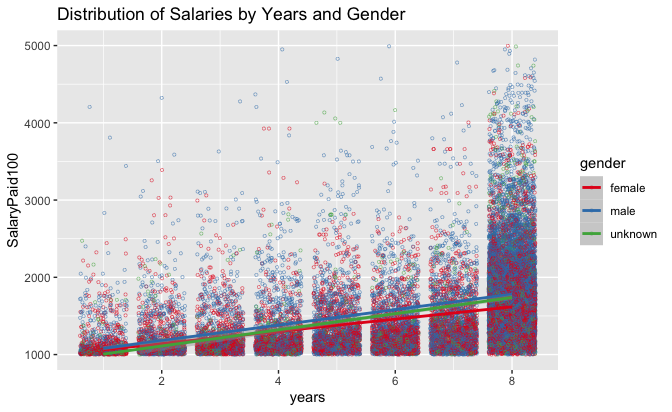<!-- -->

*Plot 6*

Following modelling, LOO analysis (**Table 11**) allows a comparison of
model iterations. Differences in the expected log predictive densities
(elpd\_diff) show that the third iteration (fit3) is preferred over
previous iterations. Standard error for this fit is considerably less
than expected log predictive densities of other models. As such, this
iteration is the most representative of the three.

<table class="table" style="margin-left: auto; margin-right: auto;">

<caption>

Model 1, LOO analysis of all three iterations

</caption>

<thead>

<tr>

<th style="text-align:left;">

</th>

<th style="text-align:right;">

elpd\_diff

</th>

<th style="text-align:right;">

se\_diff

</th>

<th style="text-align:right;">

elpd\_loo

</th>

<th style="text-align:right;">

se\_elpd\_loo

</th>

<th style="text-align:right;">

p\_loo

</th>

<th style="text-align:right;">

se\_p\_loo

</th>

<th style="text-align:right;">

looic

</th>

<th style="text-align:right;">

se\_looic

</th>

</tr>

</thead>

<tbody>

<tr>

<td style="text-align:left;">

fit3

</td>

<td style="text-align:right;">

0.000

</td>

<td style="text-align:right;">

0.00000

</td>

<td style="text-align:right;">

\-210278.0

</td>

<td style="text-align:right;">

514.7903

</td>

<td style="text-align:right;">

29.42693

</td>

<td style="text-align:right;">

9.086150

</td>

<td style="text-align:right;">

420555.9

</td>

<td style="text-align:right;">

1029.5805

</td>

</tr>

<tr>

<td style="text-align:left;">

fit2

</td>

<td style="text-align:right;">

\-2143.213

</td>

<td style="text-align:right;">

95.63991

</td>

<td style="text-align:right;">

\-212421.2

</td>

<td style="text-align:right;">

438.4778

</td>

<td style="text-align:right;">

23.49342

</td>

<td style="text-align:right;">

6.231303

</td>

<td style="text-align:right;">

424842.4

</td>

<td style="text-align:right;">

876.9556

</td>

</tr>

<tr>

<td style="text-align:left;">

fit1

</td>

<td style="text-align:right;">

\-2207.182

</td>

<td style="text-align:right;">

99.02312

</td>

<td style="text-align:right;">

\-212485.1

</td>

<td style="text-align:right;">

436.5559

</td>

<td style="text-align:right;">

16.89826

</td>

<td style="text-align:right;">

6.193654

</td>

<td style="text-align:right;">

424970.3

</td>

<td style="text-align:right;">

873.1117

</td>

</tr>

</tbody>

</table>

*Table 11*

The LOO probability integral transform (PIT) shows a comparison for each
point as it falls in its predictive distribution (**Plot 7**). The model
is underperforming; this diagnostic metric shows that the PIT line, when
compared to 4000 simulated uniform distribution (Unif) lines, is fairly
far off in shape. Further model diagnostic tests are performed within
the Appendix.

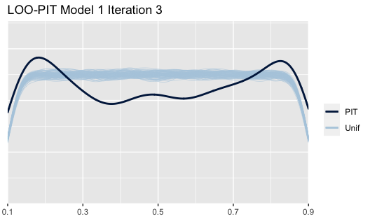<!-- -->

*Plot 7*

### Model 2

Like Model 1, Model 2 in its simplest form examines gender’s effect on
salary paid (in 100s of dollars), but is limited to 2019 (the most
recent year) and the four most common job titles containing “professor”.
As a point of clarity, throughout this analysis, the “Professor” job
title (in title case) refers to what is commonly called “Full
Professor”. By contrast, “professor” (in lower case) refers to the
collection of all professor job titles.

As *Table 2* and its discussion indicated during exploratory data
analysis, these job titles are relatively stable in frequency.
“University Professor” and “Professor” were merged into a single title
throughout this model. Like Model 1, average salaries for males are
higher than females, but in Model 2, mean values are larger for all
genders, as are the differences between them (**Table 12**). Mean Post
Posterior Distribution is slightly higher than the previous but is
relatively the same degree larger (about 8%). Rhat scores of 1.0
indicate that convergence from chains was successful. Monte Carlo
standard errors are particularly high for unknown gender professors as
there are far fewer of them. This is a stable second model to iterate
on.

<table class="table" style="margin-left: auto; margin-right: auto;">

<caption>

Model 2, Iteration 1

</caption>

<thead>

<tr>

<th style="text-align:left;">

</th>

<th style="text-align:right;">

mean

</th>

<th style="text-align:right;">

mcse

</th>

<th style="text-align:right;">

sd

</th>

<th style="text-align:right;">

10%

</th>

<th style="text-align:right;">

50%

</th>

<th style="text-align:right;">

90%

</th>

<th style="text-align:right;">

n\_eff

</th>

<th style="text-align:right;">

Rhat

</th>

</tr>

</thead>

<tbody>

<tr>

<td style="text-align:left;">

(Intercept)

</td>

<td style="text-align:right;">

1662.1365

</td>

<td style="text-align:right;">

0.2970145

</td>

<td style="text-align:right;">

19.278706

</td>

<td style="text-align:right;">

1637.1794

</td>

<td style="text-align:right;">

1662.2593

</td>

<td style="text-align:right;">

1686.3371

</td>

<td style="text-align:right;">

4213

</td>

<td style="text-align:right;">

0.9999693

</td>

</tr>

<tr>

<td style="text-align:left;">

gendermale

</td>

<td style="text-align:right;">

221.0712

</td>

<td style="text-align:right;">

0.3797577

</td>

<td style="text-align:right;">

24.905278

</td>

<td style="text-align:right;">

189.3050

</td>

<td style="text-align:right;">

221.4215

</td>

<td style="text-align:right;">

253.0332

</td>

<td style="text-align:right;">

4301

</td>

<td style="text-align:right;">

0.9997095

</td>

</tr>

<tr>

<td style="text-align:left;">

genderunknown

</td>

<td style="text-align:right;">

148.9464

</td>

<td style="text-align:right;">

0.7017531

</td>

<td style="text-align:right;">

46.980354

</td>

<td style="text-align:right;">

89.2368

</td>

<td style="text-align:right;">

149.4444

</td>

<td style="text-align:right;">

209.9223

</td>

<td style="text-align:right;">

4482

</td>

<td style="text-align:right;">

1.0001451

</td>

</tr>

<tr>

<td style="text-align:left;">

sigma

</td>

<td style="text-align:right;">

589.2079

</td>

<td style="text-align:right;">

0.1155348

</td>

<td style="text-align:right;">

8.011870

</td>

<td style="text-align:right;">

579.1430

</td>

<td style="text-align:right;">

589.1435

</td>

<td style="text-align:right;">

599.3674

</td>

<td style="text-align:right;">

4809

</td>

<td style="text-align:right;">

0.9999944

</td>

</tr>

<tr>

<td style="text-align:left;">

mean\_PPD

</td>

<td style="text-align:right;">

1795.4510

</td>

<td style="text-align:right;">

0.2498820

</td>

<td style="text-align:right;">

16.293597

</td>

<td style="text-align:right;">

1774.5283

</td>

<td style="text-align:right;">

1795.2061

</td>

<td style="text-align:right;">

1815.9605

</td>

<td style="text-align:right;">

4252

</td>

<td style="text-align:right;">

0.9997382

</td>

</tr>

<tr>

<td style="text-align:left;">

log-posterior

</td>

<td style="text-align:right;">

\-20013.3025

</td>

<td style="text-align:right;">

0.0316670

</td>

<td style="text-align:right;">

1.414619

</td>

<td style="text-align:right;">

\-20015.1331

</td>

<td style="text-align:right;">

\-20012.9877

</td>

<td style="text-align:right;">

\-20011.8574

</td>

<td style="text-align:right;">

1996

</td>

<td style="text-align:right;">

1.0021312

</td>

</tr>

</tbody>

</table>

*Table 12*

Relative to female salaries, male and unknown gender professors earn
more (**Plot 9**). It is clear there are far more male professors
earning $200,000 than female or unknown gender professors. Standard
deviations are larger for both male and unknown gender AB lines.

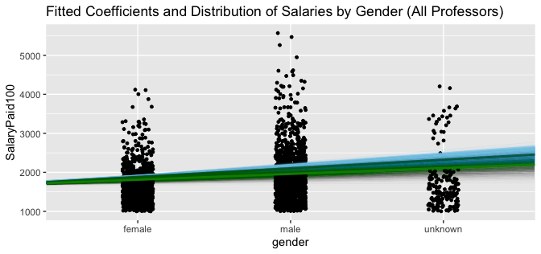<!-- -->

*Plot 9*

At second iteration (**Table 13**), the addition of Job Title (Assistant
Professor, Associate Professor, Professor, or Professor and Chair)
further separates the professors into smaller segments earning
significantly different salaries from one another. Intercept means
(female Assistant Professors) are much lower than the previous
iteration. Becoming Professor or Professor and Chair has a large effect
on salary: on average increasing by $61,000 and $88,200 per year
respectively for each position. Mean Post Posterior Distribution is
again further from the intercept mean as there are a larger number of
Professors than any other title. Rhat scores of 1.0 indicate that
convergence from chains was successful. Monte Carlo standard errors are
higher than the previous model and previous iterations. High MCSEs are
likely due to the relative infrequency of the job titles.

<table class="table" style="margin-left: auto; margin-right: auto;">

<caption>

Model 2, Iteration 2

</caption>

<thead>

<tr>

<th style="text-align:left;">

</th>

<th style="text-align:right;">

mean

</th>

<th style="text-align:right;">

mcse

</th>

<th style="text-align:right;">

sd

</th>

<th style="text-align:right;">

10%

</th>

<th style="text-align:right;">

50%

</th>

<th style="text-align:right;">

90%

</th>

<th style="text-align:right;">

n\_eff

</th>

<th style="text-align:right;">

Rhat

</th>

</tr>

</thead>

<tbody>

<tr>

<td style="text-align:left;">

(Intercept)

</td>

<td style="text-align:right;">

1203.1320

</td>

<td style="text-align:right;">

0.6158485

</td>

<td style="text-align:right;">

32.361252

</td>

<td style="text-align:right;">

1160.5974

</td>

<td style="text-align:right;">

1203.8046

</td>

<td style="text-align:right;">

1244.9585

</td>

<td style="text-align:right;">

2761

</td>

<td style="text-align:right;">

0.9995587

</td>

</tr>

<tr>

<td style="text-align:left;">

gendermale

</td>

<td style="text-align:right;">

187.5336

</td>

<td style="text-align:right;">

0.3627648

</td>

<td style="text-align:right;">

22.363968

</td>

<td style="text-align:right;">

158.6576

</td>

<td style="text-align:right;">

187.2379

</td>

<td style="text-align:right;">

216.5266

</td>

<td style="text-align:right;">

3801

</td>

<td style="text-align:right;">

1.0011465

</td>

</tr>

<tr>

<td style="text-align:left;">

genderunknown

</td>

<td style="text-align:right;">

136.7547

</td>

<td style="text-align:right;">

0.6774024

</td>

<td style="text-align:right;">

42.377405

</td>

<td style="text-align:right;">

83.2324

</td>

<td style="text-align:right;">

136.8076

</td>

<td style="text-align:right;">

190.3354

</td>

<td style="text-align:right;">

3914

</td>

<td style="text-align:right;">

0.9991726

</td>

</tr>

<tr>

<td style="text-align:left;">

JobTitleSimpleAssociate Professor

</td>

<td style="text-align:right;">

285.9145

</td>

<td style="text-align:right;">

0.7507813

</td>

<td style="text-align:right;">

38.108724

</td>

<td style="text-align:right;">

235.3967

</td>

<td style="text-align:right;">

285.8673

</td>

<td style="text-align:right;">

335.0629

</td>

<td style="text-align:right;">

2576

</td>

<td style="text-align:right;">

1.0001123

</td>

</tr>

<tr>

<td style="text-align:left;">

JobTitleSimpleProfessor

</td>

<td style="text-align:right;">

610.7264

</td>

<td style="text-align:right;">

0.6217590

</td>

<td style="text-align:right;">

32.509026

</td>

<td style="text-align:right;">

568.5329

</td>

<td style="text-align:right;">

611.3171

</td>

<td style="text-align:right;">

651.1954

</td>

<td style="text-align:right;">

2734

</td>

<td style="text-align:right;">

0.9998759

</td>

</tr>

<tr>

<td style="text-align:left;">

JobTitleSimpleProfessor and Chair

</td>

<td style="text-align:right;">

882.4052

</td>

<td style="text-align:right;">

1.3217740

</td>

<td style="text-align:right;">

74.406390

</td>

<td style="text-align:right;">

788.1662

</td>

<td style="text-align:right;">

881.6869

</td>

<td style="text-align:right;">

978.3781

</td>

<td style="text-align:right;">

3169

</td>

<td style="text-align:right;">

0.9996275

</td>

</tr>

<tr>

<td style="text-align:left;">

sigma

</td>

<td style="text-align:right;">

543.0634

</td>

<td style="text-align:right;">

0.1237308

</td>

<td style="text-align:right;">

7.652206

</td>

<td style="text-align:right;">

533.3143

</td>

<td style="text-align:right;">

543.0597

</td>

<td style="text-align:right;">

552.9429

</td>

<td style="text-align:right;">

3825

</td>

<td style="text-align:right;">

0.9995993

</td>

</tr>

<tr>

<td style="text-align:left;">

mean\_PPD

</td>

<td style="text-align:right;">

1795.3452

</td>

<td style="text-align:right;">

0.2364079

</td>

<td style="text-align:right;">

15.060967

</td>

<td style="text-align:right;">

1775.8965

</td>

<td style="text-align:right;">

1795.2819

</td>

<td style="text-align:right;">

1815.1689

</td>

<td style="text-align:right;">

4059

</td>

<td style="text-align:right;">

0.9999792

</td>

</tr>

<tr>

<td style="text-align:left;">

log-posterior

</td>

<td style="text-align:right;">

\-19807.4042

</td>

<td style="text-align:right;">

0.0408905

</td>

<td style="text-align:right;">

1.823696

</td>

<td style="text-align:right;">

\-19809.8853

</td>

<td style="text-align:right;">

\-19807.0893

</td>

<td style="text-align:right;">

\-19805.3594

</td>

<td style="text-align:right;">

1989

</td>

<td style="text-align:right;">

1.0023131

</td>

</tr>

</tbody>

</table>

*Table 13*

While gender does not appear within the model to be as influential as
job title, both the number of male Professors and their salaries are
higher than female counterparts (**Plot 10**). There are significantly
more male Professors who make more than $250,000 than female Professors.
Male Assistant Professors also appear to make more, despite there being
fewer of them. Both Associate Professor and Professor and Chair titles
on the whole have higher minimum salaries (greater than $100,000), not
wholly unsurprising, but this trend is not kept for Professors. This may
be indicative that Professor is a more flexible title across different
disciplines or that ranks are less formal. Considering that this is 2019
data, where female professors are more frequent than other years, this
inequality is likely to be far worse in previous years.

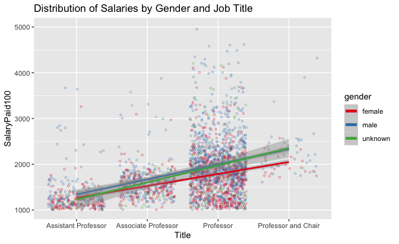<!-- -->

*Plot 10*

In its final iteration, the addition of years of experience is highly
valuable in differentiating the professor dataset further. Like the
previous model, the eighth year is overweighted, with more professors
being at (and presumably above) eight years of experience than the other
years combined (1489 vs 1076). **Table 14** shows intercept means
(female Assistant Professors) are again much lower than the previous
iteration. Male coefficients are for the first time slightly lower than
unknown gender coefficients. Becoming Professor or (less frequently)
Professor and Chair has a large effect on salary again, but year
coefficents result in considerably higher salaries: an increase of
$10,000 per year of experience. Combined with the relative frequency of
professors with at least eight years of experience, salaries will be
closer to $180,000 than $100,000, and then even higher for a Professor
or Professor and Chair. Mean Post Posterior Distribution is half of the
intercept mean as most Assistant Professors have the least experience
(shown in **Plot 12**). Rhat scores of 1.0 indicate that convergence
from chains was successful. Monte Carlo standard errors are at their
absolute highest.

<table class="table" style="margin-left: auto; margin-right: auto;">

<caption>

Model 2, Iteration 3

</caption>

<thead>

<tr>

<th style="text-align:left;">

</th>

<th style="text-align:right;">

mean

</th>

<th style="text-align:right;">

mcse

</th>

<th style="text-align:right;">

sd

</th>

<th style="text-align:right;">

10%

</th>

<th style="text-align:right;">

50%

</th>

<th style="text-align:right;">

90%

</th>

<th style="text-align:right;">

n\_eff

</th>

<th style="text-align:right;">

Rhat

</th>

</tr>

</thead>

<tbody>

<tr>

<td style="text-align:left;">

(Intercept)

</td>

<td style="text-align:right;">

899.82274

</td>

<td style="text-align:right;">

0.4637595

</td>

<td style="text-align:right;">

31.386368

</td>

<td style="text-align:right;">

858.90383

</td>

<td style="text-align:right;">

900.11413

</td>

<td style="text-align:right;">

939.40259

</td>

<td style="text-align:right;">

4580

</td>

<td style="text-align:right;">

0.9991163

</td>

</tr>

<tr>

<td style="text-align:left;">

gendermale

</td>

<td style="text-align:right;">

134.83044

</td>

<td style="text-align:right;">

0.3613661

</td>

<td style="text-align:right;">

21.391574

</td>

<td style="text-align:right;">

107.80328

</td>

<td style="text-align:right;">

134.58173

</td>

<td style="text-align:right;">

162.34018

</td>

<td style="text-align:right;">

3504

</td>

<td style="text-align:right;">

1.0009762

</td>

</tr>

<tr>

<td style="text-align:left;">

genderunknown

</td>

<td style="text-align:right;">

142.18715

</td>

<td style="text-align:right;">

0.6402987

</td>

<td style="text-align:right;">

39.598108

</td>

<td style="text-align:right;">

91.72452

</td>

<td style="text-align:right;">

142.29089

</td>

<td style="text-align:right;">

192.75877

</td>

<td style="text-align:right;">

3825

</td>

<td style="text-align:right;">

1.0004831

</td>

</tr>

<tr>

<td style="text-align:left;">

JobTitleSimpleAssociate Professor

</td>

<td style="text-align:right;">

\-93.96933

</td>

<td style="text-align:right;">

0.8032322

</td>

<td style="text-align:right;">

38.893924

</td>

<td style="text-align:right;">

\-143.34427

</td>

<td style="text-align:right;">

\-93.35127

</td>

<td style="text-align:right;">

\-43.10477

</td>

<td style="text-align:right;">

2345

</td>

<td style="text-align:right;">

1.0005233

</td>

</tr>

<tr>

<td style="text-align:left;">

JobTitleSimpleProfessor

</td>

<td style="text-align:right;">

232.67422

</td>

<td style="text-align:right;">

0.7218843

</td>

<td style="text-align:right;">

33.921170

</td>

<td style="text-align:right;">

189.31773

</td>

<td style="text-align:right;">

232.41540

</td>

<td style="text-align:right;">

275.71698

</td>

<td style="text-align:right;">

2208

</td>

<td style="text-align:right;">

1.0000862

</td>

</tr>

<tr>

<td style="text-align:left;">

JobTitleSimpleProfessor and Chair

</td>

<td style="text-align:right;">

408.88124

</td>

<td style="text-align:right;">

1.1991779

</td>

<td style="text-align:right;">

67.628235

</td>

<td style="text-align:right;">

323.51002

</td>

<td style="text-align:right;">

407.66021

</td>

<td style="text-align:right;">

496.84548

</td>

<td style="text-align:right;">

3180

</td>

<td style="text-align:right;">

1.0002854

</td>

</tr>

<tr>

<td style="text-align:left;">

years

</td>

<td style="text-align:right;">

106.72814

</td>

<td style="text-align:right;">

0.0859591

</td>

<td style="text-align:right;">

4.543945

</td>

<td style="text-align:right;">

100.92822

</td>

<td style="text-align:right;">

106.74600

</td>

<td style="text-align:right;">

112.58961

</td>

<td style="text-align:right;">

2794

</td>

<td style="text-align:right;">

1.0004425

</td>

</tr>

<tr>

<td style="text-align:left;">

sigma

</td>

<td style="text-align:right;">

493.15414

</td>

<td style="text-align:right;">

0.1055792

</td>

<td style="text-align:right;">

6.749534

</td>

<td style="text-align:right;">

484.48152

</td>

<td style="text-align:right;">

493.08757

</td>

<td style="text-align:right;">

501.85009

</td>

<td style="text-align:right;">

4087

</td>

<td style="text-align:right;">

1.0000214

</td>

</tr>

<tr>

<td style="text-align:left;">

mean\_PPD

</td>

<td style="text-align:right;">

1795.33632

</td>

<td style="text-align:right;">

0.2151867

</td>

<td style="text-align:right;">

13.881867

</td>

<td style="text-align:right;">

1777.87455

</td>

<td style="text-align:right;">

1795.53926

</td>

<td style="text-align:right;">

1812.97739

</td>

<td style="text-align:right;">

4162

</td>

<td style="text-align:right;">

0.9993625

</td>

</tr>

<tr>

<td style="text-align:left;">

log-posterior

</td>

<td style="text-align:right;">

\-19560.51393

</td>

<td style="text-align:right;">

0.0456990

</td>

<td style="text-align:right;">

2.000246

</td>

<td style="text-align:right;">

\-19563.21421

</td>

<td style="text-align:right;">

\-19560.15568

</td>

<td style="text-align:right;">

\-19558.27269

</td>

<td style="text-align:right;">

1916

</td>

<td style="text-align:right;">

1.0016053

</td>

</tr>

</tbody>

</table>

*Table 14*

The complexity of visualizing three separate explanatory variables
requires a myriad of different views into the resulting data. **Plot
11** combines AB lines for all genders with years of experience. **Plot
12** clusters years of experience and job titles within a facet for each
gender. **Plot 13** clusters job titles for each gender within a facet
for each year of experience.

As mentioned previously, more than half of staff with professor titles
are captured within the artificially overweight “eighth” year (**Plot
11**). AB lines for each gender show that years of experience result in
significantly larger salaries. Male salaries again increase more than
female salaries, even when AB lines are very close together at
`years=1`. Salaries are lifted off the $100,000 x-axis minimum for each
year quite significantly (though the eighth is an odd exception to this
trend). Male professors dominate the eighth year at a frequency of
896:492 compared to female professors. By contrast, the remaining year
categories are relatively equal for both male and female professors.

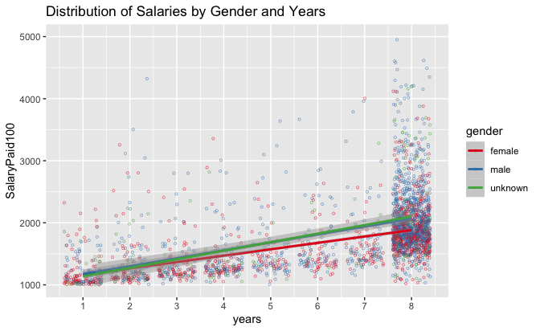<!-- -->

*Plot 11*

**Plot 12** shows that the relative composition of years of experience
and job titles is fairly conserved between male and female professor
titles. Both female and male Assistant Professors have fewer years of
experience. However, several male Assistant Professors make more than
$200,000—more than nearly all female *Associate* Professors. Similarly,
many male Associate Professors make more than $200,000, a salary more
consistent with Professor and Professor and Chair job titles. Professor
salaries near $100,000 appear to be associated with lower years of
experience. This might mean that these Professors are new to the
University of Toronto, but not new to academia, and thus can join
faculties as Full Professors. This highlights another limitation to the
“years of experience” metric. Male Professors, as noted elsewhere, are
far more likely to make more than $300,000 compared to female
Professors. Without further differentiation, it is difficult to identify
a discernable reason for this trend.

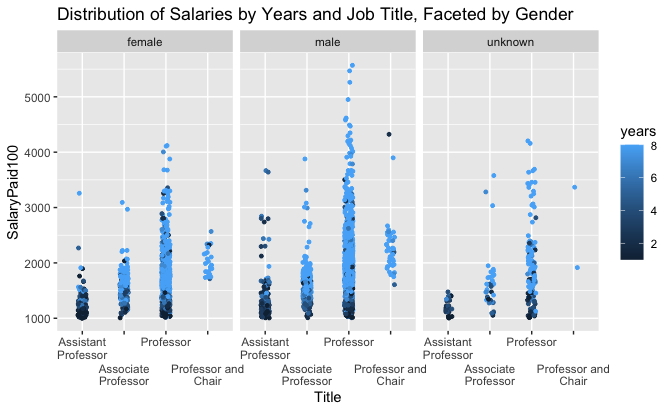<!-- -->

*Plot 12*

Lastly, **Plot 13** further helps to emphasize the relationship between
years of experience and job title. While gender is somewhat lost in the
scale of the visualization, it becomes clear that there are very few
Assistant Professors (red) for either gender when `years>4`. Associate
Professors (blue) are not easily distinguished from Professors (green)
except by salary. There appear to be far more male Professors by the
fifth year than females. It is unknown whether this is caused by
changing universities, or if other social barriers limit female
Associate Professors from becoming Full Professors.

<!-- -->

*Plot 13*

LOO analysis (**Table 15**) again shows preference to the third and
final iteration (fit6). Differences in the expected log predictive
densities (elpd\_diff) are less drastic, showing that while the
inclusion of additional explanatory variables makes for a better model,
filtering the overall dataset to the four most common professor titles
for the calendar year 2019 results in a better uniform distribution.
Standard error for this fit is also less than the expected log
predictive densities of other models.

<table class="table" style="margin-left: auto; margin-right: auto;">

<caption>

Model 2, LOO analysis of all three iterations

</caption>

<thead>

<tr>

<th style="text-align:left;">

</th>

<th style="text-align:right;">

elpd\_diff

</th>

<th style="text-align:right;">

se\_diff

</th>

<th style="text-align:right;">

elpd\_loo

</th>

<th style="text-align:right;">

se\_elpd\_loo

</th>

<th style="text-align:right;">

p\_loo

</th>

<th style="text-align:right;">

se\_p\_loo

</th>

<th style="text-align:right;">

looic

</th>

<th style="text-align:right;">

se\_looic

</th>

</tr>

</thead>

<tbody>

<tr>

<td style="text-align:left;">

fit6

</td>

<td style="text-align:right;">

0.0000

</td>

<td style="text-align:right;">

0.00000

</td>

<td style="text-align:right;">

\-19549.59

</td>

<td style="text-align:right;">

76.04399

</td>

<td style="text-align:right;">

10.590831

</td>

<td style="text-align:right;">

1.1730731

</td>

<td style="text-align:right;">

39099.18

</td>

<td style="text-align:right;">

152.0880

</td>

</tr>

<tr>

<td style="text-align:left;">

fit5

</td>

<td style="text-align:right;">

\-246.5938

</td>

<td style="text-align:right;">

21.80091

</td>

<td style="text-align:right;">

\-19796.19

</td>

<td style="text-align:right;">

68.35855

</td>

<td style="text-align:right;">

8.596233

</td>

<td style="text-align:right;">

0.8733031

</td>

<td style="text-align:right;">

39592.37

</td>

<td style="text-align:right;">

136.7171

</td>

</tr>

<tr>

<td style="text-align:left;">

fit4

</td>

<td style="text-align:right;">

\-454.2491

</td>

<td style="text-align:right;">

25.91388

</td>

<td style="text-align:right;">

\-20003.84

</td>

<td style="text-align:right;">

62.55362

</td>

<td style="text-align:right;">

6.062164

</td>

<td style="text-align:right;">

0.6172564

</td>

<td style="text-align:right;">

40007.68

</td>

<td style="text-align:right;">

125.1072

</td>

</tr>

</tbody>

</table>

*Table 15*

The LOO PIT (**Plot 14**) diagnostic metric is significantly better than
the previous model. Nearly all points fall within its predictive
distribution. The model performs better because there no pareto outliers
of concern (which were present in Model 1, as discussed within the
Appendix). The model is not bad, although limitations have been
discussed throughout this section. Further model diagnostic tests are
also performed within the Appendix.

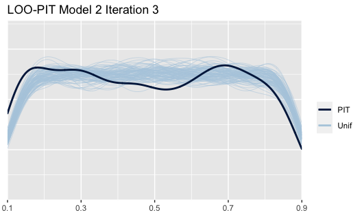<!-- -->

*Plot 14*

## Discussion

Model 1 evaluation generally shows a strong trend of males being paid
more than females throughout the University of Toronto. As model
complexity increases, explanatory variables show that despite claims of
narrowing pay inequality made by the University Provost in 2019, the
wage gap between female and male staff exists and is increasingly worse
year over year. The model would perform better with additional years of
data and should be run again with 2020 data to see if the mean
differences between genders decrease. The university appears, on the
whole, to be hiring more female staff, and perhaps a more diverse set of
staff (as noted by the increasing frequency of encoding staff as unknown
gender caused by names less likely to be referenced in the underlying
datasets of the `gender` package (Mullen 2020)). It is unclear whether
these newer hires are always brought into lower level positions; for
example, we see an increase in Assistant Professors across years but the
number of employees also increases every year. To see better equality in
pay across gender, the university needs to also balance promotions
equally across gender. Simply put, the vast majority of the highest
paying jobs are held by males. Model 1 diagnostics (§Appendix 1) show
sensitivity to some of these extreme outliers. A logical next step might
be to simulate high salary female outliers.

Even if the university is in fact hiring more female staff, Model 2
shows that female professors are paid less than males, regardless of job
title and years of experience. It is apparent that many factors
contribute to the wage gap and the model does not sufficiently explain
these with the explanatory variables developed within this dataset. The
model should be run again on previous calendar years. The overweight
“eighth” year again limits more complex conclusions from being drawn
from the model. Patterns may emerge that suggest some of the highest
paid male Professors have remained at the University of Toronto for
many, many years. It would be useful to explore whether male and female
professors successfully progress to each year of experience at the same
rate (in other words, is a male professor more likely to reach major
milestones than a female professor). This might help to determine if
social barriers result in higher salaries for males, rather than
strictly differences in salaries paid to each gender. The analysis
should be rerun with 2020 data as soon as it is available.

Next steps for both models should, first and foremost, incorporate more
years into the dataset. The addition of years of experience begins to
differentiate staff quite significantly (as both **Plot 12** and **Plot
13** do well to articulate for professors). However, there is so much
grouping at the eighth year that it becomes extremely difficult to draw
any real conclusions on models that use gender and years of experience
together to explain variances in salary paid. Greater differentiation
amongst staff, by either years of experience or a supplemental dataset
for titles and departments, using variants of these models to generate
future salary predictions should be possible. Predictions made without
this differentiation were largely unsuccessful because they relied too
heavily on only a few discrete bins (three “genders”, four job titles,
and 1-8 years of experience: a total of 72 different combinations from
which to classify ~2000 professors, all of which seem to have relatively
similar salaries). Connections between these variables emerge even
within this limited set of explanatory variable levels.

From both of these models, it remains apparent that female staff and
professors are paid less than their male counterparts. This is
consistent with studies conducted previously. Due to the limitations of
the dataset ($100,000 minimum salary, difficulty in parsing job titles
and faculties, and no explicitly stated gender), the University of
Toronto should consider providing an internally generated dataset
(albeit, anonymity issues may arise, so access to this dataset should be
restricted). Research conducted appropriately might help address the
wage gap with greater clarity.

## Appendix

### Model 1 evaluation metrics

The following metrics were performed on the final iteration of the
model:

  - A PSIS diagnostic plot checking for pareto values above 0.6. One
    point was present above this value (*Plot A1.1*).
  - A density plot, comparing the distribution of `y` and `y_rep`
    predicted values. Model shapes are not as similar as we would
    expect, especially as `y_rep` values overly represent values below
    the $100,000 cut-off imposed by the dataset (*Plot A1.2*).
  - A scatterplot of means and standard deviations for `y` and `y_rep`.
    Clustering is heavily focused near to the mean and standard
    deviation is reasonable (*Plot A1.3*).
  - A scatterplot comparing `y` to average `y_rep`. The average line is
    extremely low, showing that the model cannot predict salaries
    significantly above the average `y` mean as seen in the previous
    plot (*Plot A1.4*).

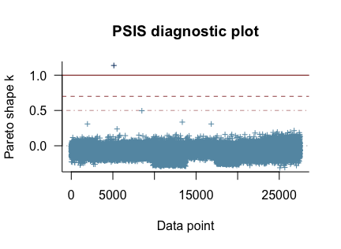<!-- -->

*Plot A1.1*

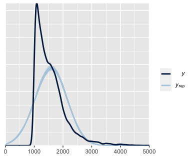<!-- -->

*Plot A2.1*

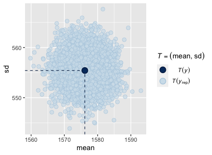<!-- -->

*Plot A3.1*

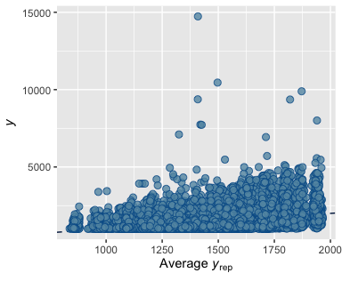<!-- -->

*Plot A4.1*

Evaluation metrics show that Model 1’s final iteration performs slightly
below necessary requirements. Additional data points would likely
improve this model significantly. The inability for the model to
differentiate supporting staff from professors, as well as outlier staff
members who make significantly larger salaries, have a demonstrated
effect on the model.

### Model 2 evaluation metrics

Like Model 1, the following metrics were performed on the final
iteration of the model:

  - A PSIS diagnostic plot checking for pareto values above 0.6. No
    points were above this value (*Plot A2.1*).
  - A density plot, comparing the distribution of `y` and `y_rep`
    predicted values. Model shapes are better than Model 1, though fail
    to account for the steep drop-off in salaries just above $200,000.
    Like Model 1, `y_rep` values overly represent values below the
    $100,000 cut-off imposed by the dataset (*Plot A2.1*).
  - A scatterplot of means and standard deviations for `y` and `y_rep`.
    Standard deviations are much higher and means span a significantly
    larger range than Model 1. (*Plot A2.3*)
  - A scatterplot comparing `y` to average `y_rep`. The average line is
    significantly better at predicting higher salaries (those above
    $250,000) than Model 1, but shows significant vertical grouping at
    various `y_rep` intervals. (*Plot A2.4*)

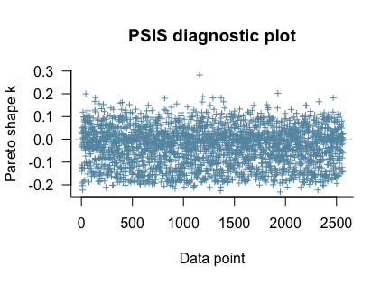<!-- -->

*Plot A1.2*

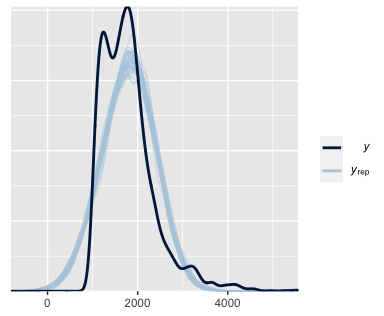<!-- -->

*Plot A2.2*

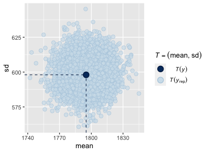<!-- -->

*Plot A3.2*

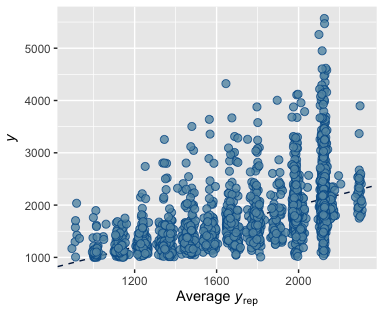<!-- -->

*Plot A4.2*

Evaluation metrics show that while Model 2 performs much better than
Model 1, it too lacks the necessary variables to accurate predict
differences in professor salaries. As mentioned in §Results, Model 2 was
disproportionately shaped by “eighth” year professors, where
insufficient history created an artificially large grouping for
professors who appeared on the sunshine list for all years of data.

## References

Benjamin, Dwayne, Alison Gibbs, Joanne Oxley, Julia Rabinovich, and
Boriana Miloucheva. 2019. “Design Justice.”
<https://www.provost.utoronto.ca/planning-policy/gender-pay-equity/>.

Blevins, C., and Lincoln Mullen. 2015. “Jane, John ... Leslie? A
Historical Method for Algorithmic Gender Prediction.” *Digital
Humanities Quarterly* 9.

Brilleman, SL, MJ Crowther, M Moreno-Betancur, J Buros Novik, and R
Wolfe. n.d. “Joint Longitudinal and Time-to-Event Models via Stan.”
<https://github.com/stan-dev/stancon_talks/>.

Costanza-Chock, Sasha. 2020. “Introduction: \#TravelingWhileTrans,
Design Justice, and Escape from the Matrix of Domination.” In *Design
Justice*. <https://design-justice.pubpub.org/pub/ap8rgw5e>.

Council of Canadian Academies. 2012. *Strengthening Canada’s Research
Capacity : The Gender Dimension*.
<https://cca-reports.ca/wp-content/uploads/2018/10/wur_fullreporten.pdf.pdf>.

Cummings, Madeleine. 2020. “Pay Gap Between Male and Female Professors
Continues to Plague Canadian Universities | Cbc News.” *CBCnews*.
CBC/Radio Canada.
<https://www.cbc.ca/news/canada/edmonton/gender-pay-gap-persists-at-canadian-universities-1.5739466>.

Dowle, Matt, and Arun Srinivasan. 2019. *Data.table: Extension of
‘Data.frame‘*. <https://CRAN.R-project.org/package=data.table>.

Gabry, Jonah, Daniel Simpson, Aki Vehtari, Michael Betancourt, and
Andrew Gelman. 2019. “Visualization in Bayesian Workflow.” *J. R. Stat.
Soc. A* 182 (2): 389–402. <https://doi.org/10.1111/rssa.12378>.

Grolemund, Garrett, and Hadley Wickham. 2011. “Dates and Times Made Easy
with lubridate.” *Journal of Statistical Software* 40 (3): 1–25.
<https://www.jstatsoft.org/v40/i03/>.

Hadley Wickham. 2019. *Babynames: US Baby Names 1880-2017*.
<https://CRAN.R-project.org/package=babynames>.

Kaplan, Jacob. 2020. *FastDummies: Fast Creation of Dummy (Binary)
Columns and Rows from Categorical Variables*.
<https://CRAN.R-project.org/package=fastDummies>.

Mihaljević, Helena, Marco Tullney, and Lucía Santamaría. 2016. “The
Effect of Gender in the Publication Patterns in Mathematics.” *PLOS ONE*
11 (10): 1–23. <https://doi.org/10.1371/journal.pone.0165367>.

Mihaljević, Helena, Marco Tullney, Lucía Santamaría, and Christian
Steinfeldt. 2019. “Reflections on Gender Analyses of Bibliographic
Corpora.” *Frontiers in Big Data* 2.
<https://doi.org/10.3389/fdata.2019.00029>.

Momani, Emma ; Williams, Bessma ; Dreher. 2019. “More Than a Pipeline
Problem: Evaluating the Gender Pay Gap in Canadian Academia from 1996 to
2016.” *Canadian Journal of Higher Education / Revue Canadienne
d&\#x27;enseignement Supérieur* 49 (1). Canadian Society for the Study
of Higher Education: 1–21.
<https://doi.org/https://doi.org/10.7202/1060821ar>.

Mullen, Lincoln. 2020. *Gender: Predict Gender from Names Using
Historical Data*. <https://github.com/ropensci/gender>.

Müller, Kirill. 2017. *Here: A Simpler Way to Find Your Files*.
<https://CRAN.R-project.org/package=here>.

R Core Team. 2020. *R: A Language and Environment for Statistical
Computing*. Vienna, Austria: R Foundation for Statistical Computing.
<https://www.R-project.org/>.

Wickham, Hadley. 2016. *Ggplot2: Elegant Graphics for Data Analysis*.
Springer-Verlag New York. <https://ggplot2.tidyverse.org>.

Wickham, Hadley, Mara Averick, Jennifer Bryan, Winston Chang, Lucy
D’Agostino McGowan, Romain François, Garrett Grolemund, et al. 2019.
“Welcome to the tidyverse.” *Journal of Open Source Software* 4 (43):
1686. <https://doi.org/10.21105/joss.01686>.

Zhu, Hao. 2020. *KableExtra: Construct Complex Table with ’Kable’ and
Pipe Syntax*. <https://CRAN.R-project.org/package=kableExtra>.

