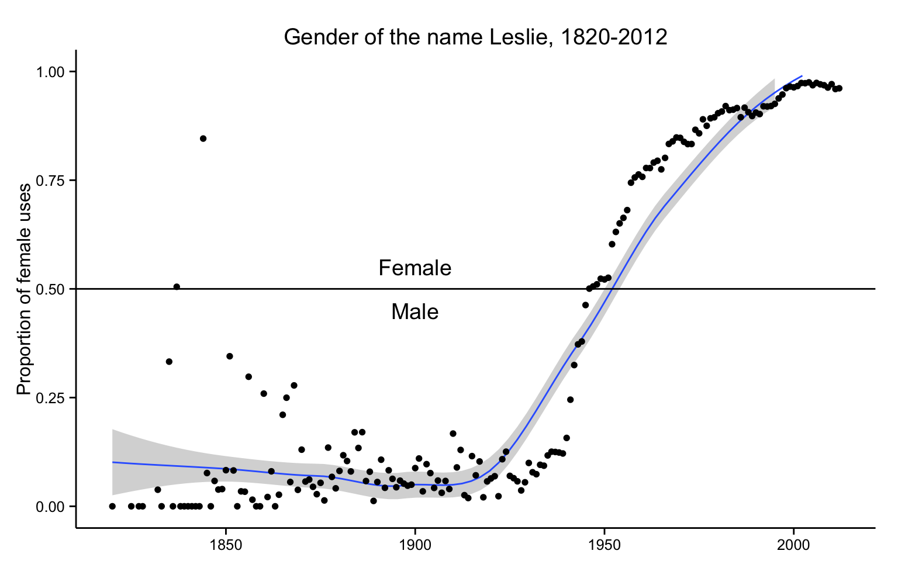

```{r setup, echo=FALSE}
knitr::opts_chunk$set(echo = FALSE)
options(scipen=99999)
```

```{r libraries, warning=FALSE, message=FALSE}
#Load Library
library(tidyverse)
library(data.table)
library(here)
library(rstanarm)
library(gender)
library(ggplot2)
library(bayesplot)
library(kableExtra)
```

## Introduction

Academia is increasingly female. Within Canadian institutions of higher education, gender parity was reached for students in 1989 (Council of Canadian Academies, 2012). Research in 2012 using Statistics Canada surveys found that women outnumbered men in both undergraduate and graduate programs and represented nearly 50% of all PhD students. As such, staff ratios at universities for both administrator and professor positions should begin to reach gender parity as qualified women graduates enter into the workforce. However, simply hiring more women does not address known wage gaps between genders. Momani et al. found, "men were paid on average 2.06%, 2.14%, and 5.26% more than their women colleagues for all employees, university teaching staff, and deans, respectively" within Ontario higher education from 1996-2016 (2019). Similarly, the CBC reported in 2020 that similar wage gaps existed in Alberta following preliminary data analysis from Statistics Canada salary data (Cummings, 2020). The University of Toronto Provost specifically addressed the gap in 2019, following the university's internal salary audits, noting that female faculty were at least 3.9% underpaid compared to men in similar positions (Benjamin et al. 2019).

This analysis highlights the inequality in both the number of female staff at the University of Toronto and their lower-than-male salaries through exploratory data analysis and two Gaussian Bayesian models using Ontario's Public Sector Salary Disclosure from 2012-2019 (also known as "The Sunshine List"). The Sunshine List is available for download through open data initiatives to disclose the salaries of all public employees earning more than $100,000 per annum in Ontario. The analysis examines the effects of gender, title, and years of experience (see §Dataset). Both exploratory data analysis and Bayesian models found that female professors and staff are paid less than their male counterparts with similar titles, and this wage gap is increasingly worse year over year.

Following context and exploratory data analysis, the first of two models will consider the entire University of Toronto staff from 2012-2019. High-level results reveal that women are indeed paid less than men, and despite increasing female employment each year, the wage gap is increasing. The second model focuses on the four most common professor titles in the most recent year (2019). High-level results reveal that female professors are paid less than male professors, and most full professor roles are still held by men rather than women. 

## Data Exploration

Ontario makes available public sector salary disclosures from 1996-2019 (or most current year) available through the Open Data Ontario portal, or for each year as a .csv file from [ontario.ca/page/public-sector-salary-disclosure](https://www.ontario.ca/page/public-sector-salary-disclosure). Every file is limited to publicly held positions earning greater than $100,000 per annum.

Eight columns are present throughout: _Sector_ and _Employer_, the _Last Name_ and _First Name_ of every employee, their corresponding _Salary Paid_ and _Taxable Benefits_ amounts, and their _Job Title_.	_Calendar Year_ is added as reference to differentiate years from one another.

```{r load, message=FALSE, warning=FALSE}
#Load Data
#function for fread (data.table)
read_plus <- function(flnm) {
    read_csv(flnm) %>% 
        mutate(filename = flnm) %>% #adds the filename
        mutate(`Salary Paid` = as.character(`Salary Paid`)) %>% #allows for $000,000 notation, some files were int
        mutate(`Taxable Benefits` = as.character(`Taxable Benefits`)) %>% 
        rename_with(str_to_title) #fixes title case vs lower case issue for colnames between filenames
  }

datafolder = paste0(here(),'/data')

raw_data = 
    list.files(path = datafolder,
      pattern = "*.csv",
      full.names = T) %>% 
    map_df(~read_plus(.))

```

```{r jitt_fx}
# A function to slightly jitter the binary data
jitt <- function(...) {
  geom_point(aes_string(...), position = position_jitter(height = 0.05, width = 0.1),
             size = 2, shape = 21, stroke = 0.2)
}
```

```{r fix2016}
#fix the rows that were skipped
#set the year as 2016, instead of NA
raw_data <- raw_data %>% mutate(`Calendar Year` = if_else(is.na(`Calendar Year`), 2016, `Calendar Year`))
```

```{r nullchecks, include=FALSE}
raw_data %>% mutate(SalaryPaid = parse_number(`Salary Paid`), .after = "Salary Paid", .keep="unused")  %>%
    map_df(function(x) sum(is.na(x))) %>%
    gather(feature, num_nulls) %>%
    print(n = 100)
```

```{r UofT_filter}
#filter to UofT only
UofT <- raw_data %>% filter(Employer %in% c('University of Toronto','University Of Toronto')) %>% 
                              rename(FirstName = `First Name`)
```

```{r gender_first}
first_names <- UofT %>% distinct(FirstName)

#construct counting dataframe for reference "na_gender"
na_gender <- data.frame(iteration = "Unique Names",unknown_names = as.integer(nrow(first_names)))
na_gender$iteration <- as.character(na_gender$iteration)

#attach to gender package
gendered_names <- gender(first_names$FirstName)
```

```{r first_pass}
#join to UofT
UofT_gen <- left_join(UofT, gendered_names, by = c("FirstName" = "name"))
UofT_gen <- UofT_gen %>% mutate(ID = row_number())

#append to na_gender
na_gender <- rbind(na_gender, c("First Pass",nrow(UofT_gen %>% filter(is.na(gender)) %>% distinct(FirstName))))
```

```{r jan, echo = FALSE}
#jan sample case
jan <- UofT_gen %>% filter(FirstName == "Jan") %>% distinct(`Last Name`, FirstName, gender, `Job Title`)
```

```{r two_first_names, message=FALSE, warning=FALSE }
#split names like "Thomas William" into two columns, first  and second
adj <- UofT %>%  
  mutate(FirstNameadj = str_replace(FirstName, "\\s", "|")) %>% 
  separate(FirstNameadj, into = c("first","second"), sep = "\\|")

#attach to gender table for each
gendered_names <- gender(adj$first)
gendered_names_second <- gender(adj$second)
```

```{r UofTgen_join1}
#join to UofT_gen for each
UofT_gen <- left_join(adj, gendered_names, by = c("first" = "name")) %>% distinct()
UofT_gen <- UofT_gen %>% mutate(ID = row_number())

UofT_gen_x <- left_join(adj, gendered_names_second, by = c("second" = "name")) %>% distinct()
UofT_gen <- UofT_gen %>% 
    mutate(gender = coalesce(gender,UofT_gen_x$gender))

#append to na_gender
na_gender <- rbind(na_gender, c("Two First Names",nrow(UofT_gen %>% filter(is.na(gender)) %>% distinct(FirstName))))
```

```{r paren_names, message=FALSE, warning=FALSE}
#split names like "Thomas (William)" into two columns, first and paren
adj <-
  UofT %>% 
  mutate(FirstNameadj = str_replace(FirstName, "\\s", "|")) %>% 
  separate(FirstNameadj, into = c("first","second"), sep = "\\|") %>% 
  mutate(paren = str_extract(second, "\\(([^()]*)\\)")) %>% 
  mutate(paren = str_replace(paren,"\\(",'')) %>% 
  mutate(paren = str_replace(paren,"\\)",''))

#attach paren names to gender package
gendered_names <- gender(adj$paren)
```

```{r UofTgen_join2}
#join to UofT_gen 
UofT_gen_y <- left_join(adj, gendered_names, by = c("paren" = "name")) %>% distinct()
UofT_gen <- UofT_gen %>% 
    mutate(gender = coalesce(gender,UofT_gen_y$gender))

#append to na_gender
na_gender <- rbind(na_gender, c("Names in Parentheses",nrow(UofT_gen %>% filter(is.na(gender)) %>% distinct(FirstName))))
```

```{r hypen_names, message=FALSE, warning=FALSE}
#split names like "Thomas-William" into two columns, first and second
adj <- UofT %>%  
  mutate(FirstNameadj = str_replace(FirstName, "-", "|")) %>% 
  separate(FirstNameadj, into = c("first","second"), sep = "\\|")

#attach first names to gender package
gendered_names <- gender(adj$first)
```

```{r UofTgen_join3}
#join to UofT_gen 
UofT_gen_z <- left_join(adj, gendered_names, by = c("first" = "name")) %>% distinct()
UofT_gen <- UofT_gen %>% 
    mutate(gender = coalesce(gender,UofT_gen_z$gender))

#append to na_gender
na_gender <- rbind(na_gender, c("Hyphenated First Names",nrow(UofT_gen %>% filter(is.na(gender)) %>% distinct(FirstName))))
```

```{r UofTgen_clean}
#minor format changes to UofT_gen
UofT_gen <- UofT_gen %>% mutate(SalaryPaid = parse_number(`Salary Paid`), .after = "Salary Paid", .keep="unused")
UofT_gen <- UofT_gen %>% mutate(CalendarYear =  as.factor(`Calendar Year`), .after = "Calendar Year", .keep="unused")
```

```{r UofTprofs, warning= FALSE}
#create UofT professors
UofT_prof <- UofT_gen %>% 
  mutate(JobTitleAdj = str_replace(str_replace(str_replace(`Job Title`, ", ", "|"), " of ","|"), " Of ","|")) %>% 
            separate(JobTitleAdj, into = c("outer","inner"), sep = "\\|") %>% filter(outer %like% 'rofessor') %>% 
            filter(CalendarYear ==2019) %>% group_by(outer) %>% 
            filter(n() >= 5)
UofT_prof$outer2 <- str_wrap(UofT_prof$outer, width = 15)
```

```{r sunshine_years, warning= FALSE}
#get the number of years (out of eight) that a UofT person has been on the sunshine list, based on fullnames
years <- UofT_gen %>% 
  #remove a whole bunch of characters to smooth out names for summarizing
  mutate_all(funs(str_replace_all(.,"[\\.,–']",''))) %>% 
  mutate_all(funs(str_replace_all(.,'–',''))) %>% 
  mutate_all(funs(str_replace_all(.,'-',''))) %>% 
  mutate_all(funs(str_replace_all(.,' ',''))) %>% 
  mutate_all(funs(str_replace_all(.,"\\s*\\([^\\)]+\\)",''))) %>% 
  select(`Last Name`, FirstName, CalendarYear) %>% mutate(fullname = paste(`Last Name`, FirstName, sep = ', ')) %>% 
  mutate(fullname = tolower(fullname))  %>% 
  group_by(fullname) %>% 
  summarise(years=n()) %>% 
  filter(years <= 8) #handle duplicate names who exceeded 8 years experience
```

```{r fullname_transformation , warning= FALSE}
UofT_gen <- UofT_gen %>% mutate_at(vars(`Last Name`),funs(str_replace_all(.,"[\\.,–']",''))) %>% 
  mutate_at(vars(`Last Name`),funs(str_replace_all(.,'–',''))) %>% 
  mutate_at(vars(`Last Name`),funs(str_replace_all(.,'-',''))) %>% 
  mutate_at(vars(`Last Name`),funs(str_replace_all(.,' ',''))) %>% 
  mutate_at(vars(`Last Name`),funs(str_replace_all(.,"\\s*\\([^\\)]+\\)",''))) %>% 
  mutate_at(vars(FirstName),funs(str_replace_all(.,'–',''))) %>% 
  mutate_at(vars(FirstName),funs(str_replace_all(.,'-',''))) %>% 
  mutate_at(vars(FirstName),funs(str_replace_all(.,' ',''))) %>% 
  mutate_at(vars(FirstName),funs(str_replace_all(.,"\\s*\\([^\\)]+\\)",'')))

UofT_gen <- UofT_gen %>% mutate(fullname = paste(`Last Name`, FirstName, sep = ', ')) %>% 
  mutate(fullname = tolower(fullname))
```

```{r UofTdeans, warning= FALSE}
#create UofT deans
UofT_dean <- UofT_gen %>% 
  mutate(JobTitleAdj = str_replace(str_replace(str_replace(`Job Title`, ", ", "|"), " of ","|"), " Of ","|")) %>% 
            separate(JobTitleAdj, into = c("outer","inner"), sep = "\\|") %>% filter(outer %like% 'Dean') %>% 
            filter(CalendarYear ==2019) %>% group_by(outer) %>% 
            filter(n() >= 5)

UofT_dean$outer2 <- str_wrap(UofT_dean$outer, width = 15)
```

```{r UofTischool, include=FALSE, warning=FALSE}
#create ischool dean and professors for 2019
UofT_ischool <- UofT_gen %>% filter(`Job Title` %like% 'of Information') %>% 
            filter(CalendarYear ==2019) %>% filter(`Last Name` %in% c('Eskenazi','Fiege') == FALSE) %>% 
            mutate(JobTitleAdj = str_replace(str_replace(str_replace(`Job Title`, ", ", "|"), " of ","|"), " Of ","|")) %>% 
            separate(JobTitleAdj, into = c("outer","inner"), sep = "\\|")

UofT_ischool$outer2 <- str_wrap(UofT_ischool$outer, width = 15)
```

```{r plot1_creation}
#boxplot of salary by year by gender
`(ᵔᴥᵔ)` <- ggplot(UofT_gen %>% replace_na(list(gender = 'unknown')), aes(x=CalendarYear, y=SalaryPaid, fill=gender)) + 
    geom_boxplot(outlier.shape = NA) +
    scale_fill_brewer(palette = "Set1") 

ylim1 = boxplot.stats(UofT_gen$SalaryPaid)$stats[c(1, 5)]

`(ᵔᴥᵔ)` = `(ᵔᴥᵔ)` + coord_cartesian(ylim = ylim1*1.1)
```

```{r plot2_creation, warning=FALSE, message=FALSE}
#boxplot of salary for professor by gender
`|⚆ _ ⚆|` <- ggplot(UofT_prof %>% replace_na(list(gender = 'unknown')), aes(x=outer2, y=SalaryPaid, fill=gender)) + 
    geom_boxplot() +
    scale_fill_brewer(palette = "Set1")

ylim1 = boxplot.stats(UofT_prof$SalaryPaid)$stats[c(1, 5)]

`|⚆ _ ⚆|` = `|⚆ _ ⚆|` + coord_cartesian(ylim = ylim1*1.05)
```

```{r plot3_creation,  warning=FALSE, message=FALSE}
#boxplot of salary by year by gender with professors removed
UofT_not_prof <- UofT_gen %>% anti_join(UofT_gen %>% 
  mutate(JobTitleAdj = str_replace(str_replace(str_replace(`Job Title`, ", ", "|"), " of ","|"), " Of ","|")) %>% 
            separate(JobTitleAdj, into = c("outer","inner"), sep = "\\|") %>% filter(outer %like% 'rofessor'))

`(• ε •)` <- ggplot(UofT_not_prof, aes(x=CalendarYear, y=SalaryPaid, fill=gender)) + 
    geom_boxplot(outlier.shape = NA) +
    scale_fill_brewer(palette = "Set1")

ylim1 = boxplot.stats(UofT_not_prof$SalaryPaid)$stats[c(1, 5)]

`(• ε •)` = `(• ε •)` + coord_cartesian(ylim = ylim1*1.05)
```

```{r dean_plot, include=FALSE}
#boxplot of salary for deans by gender
`|-.-|` <- ggplot(UofT_dean, aes(x=outer2, y=SalaryPaid, fill=gender)) + 
    geom_boxplot() +
    scale_fill_brewer(palette = "Set1")

ylim1 = boxplot.stats(UofT_dean$SalaryPaid)$stats[c(1, 5)]

`|-.-|` = `|-.-|` + coord_cartesian(ylim = ylim1*1.05)
```

```{r ischool_plot, include=FALSE}
#boxplot of ischool professors and dean by gender, not included in paper
`(☞ﾟヮﾟ)☞` <- ggplot(UofT_ischool ,aes(x=outer2, y=SalaryPaid, fill=gender)) + 
    geom_boxplot() +
    scale_fill_brewer(palette = "Set1")

`(☞ﾟヮﾟ)☞`
```

```{r plot4_creation, include=FALSE}
#density plot salary faceted by gender
`｡◕‿◕｡` <- ggplot(data = UofT_gen, aes(x=SalaryPaid)) + 
  geom_density(aes(fill=gender), alpha = 0.4) 

`｡◕‿◕｡` <- `｡◕‿◕｡` + facet_wrap( ~ gender) + xlim(c(0, 500000))
```

```{r plot4_v2, warning= FALSE}
#density plot salary by gender
`｡◕‿◕｡` <- ggplot(UofT_gen %>% replace_na(list(gender = 'unknown')), aes(x = SalaryPaid, y = ..density.., fill = gender)) +
  geom_density(alpha = .4) + xlim(c(100000, 500000)) +
  #scale_fill_manual(values = c("female", "male","unknown")) 
  scale_fill_manual(values = c("#F7766D", "#38BEC4","#7F7F7F"), labels = c( "female", "male",  "unknown"))
  #c("#E3211C", "#397DB8","#4DB149")
  #c("#F7766D", "#38BEC4","#7F7F7F")
```

```{r plot4_v3, include=FALSE}
#density plot salary above 500k
`(^̮^)` <- ggplot(UofT_gen, aes(x = SalaryPaid, y = ..density.., fill = gender)) +
  geom_density(alpha = 0.4)  + xlim(c(500000, 1500000))

`(^̮^)`
```

### Dataset

This analysis is limited from 2012-2019 calendar years to allow for local processing. The analysis should be reproducible for all years (1996-Present), though some additional flexibility may be required during file loading to handle column differences (however, several of these are already resolved).

**Table 1** exemplifies typical formatting, in this case filtered to relevant University of Toronto staff (names have been generated for this purpose to preserve privacy using the `babynames` package [@babynames], however job titles and salaries were randomly selected from all years). Salary Paid columns varied in formatting across years.

```{r table_1, message=FALSE, warning=FALSE}
babynames <- sample(x = babynames::babynames %>% filter(prop > 0.01) %>% 
                                   select(name) %>% unique() %>% unlist(), 
                                 size = 6, replace = FALSE)

UofT_fake <- UofT %>% select(`Last Name`, FirstName, `Salary Paid`, `Job Title`, `Calendar Year`) %>% sample_n(.,6)
UofT_fake$`Last Name` <- c("Smith", "Johnson","Williams","Brown","Jones","Miller")
UofT_fake$FirstName <- UofT_fake$`First Name`
UofT_fake$`First Name` <- babynames
UofT_fake <- UofT_fake %>% relocate(`First Name`, .after = `Last Name`) %>% 
  mutate(`Job Title` = str_wrap(UofT_fake$`Job Title`, width = 15))

kable(UofT_fake, caption="Sample Dataset Rows", booktabs = TRUE, linesep= "") %>% 
  kableExtra::kable_styling(latex_options = c("stripped","scale_down", "HOLD_position"))
```
*Table 1*

It is worth noting that Ontario's public sector salary disclosure does not separate job titles into positions and corresponding departments/faculties. Future analysis should consider matching job titles to a supplementary dataset, rather than relying on text parsing. As such, this work limits job title to the broadest categories: properly parsed, Assistant Professor, Associate Professor, Professor, and Professor and Chair are the most frequently occurring job titles for each year. Inclusion of "lecturer" titles affects this frequency, where its prevalence is highly noted in earlier years (for example, it is more frequent than Assistant Professor in 2012-2014). Variance across years tends to emerge in less frequent titles, and small inconsistencies in Job Titles affect the overall precision of these groupings. **Table 2** represents the top three Job Titles after parsing for each year.

```{r table_2, message=FALSE, warning=FALSE}
UofT_title <- UofT_gen %>% 
  mutate(JobTitleAdj = str_replace(str_replace(str_replace(`Job Title`, ", ", "|"), " of ","|"), " Of ","|")) %>% 
            separate(JobTitleAdj, into = c("outer","inner"), sep = "\\|") %>% filter(outer %like% 'rofessor') %>% 
            group_by(CalendarYear, outer) %>% summarize(count = n()) %>% arrange_(~ desc(count)) %>% slice(1:3)

kable(UofT_title %>% rename(JobTitle = outer), 
      caption= "Three Most Frequent Job Titles by Year", booktabs = TRUE, linesep= "") %>% 
  kableExtra::kable_styling(latex_options = c("HOLD_position"))
```
*Table 2*

The variable 'years' was added alongside Job Titles to further separate employees with significant differences in salary but no other observable differences. Years represents an apparent level of experience by measuring the number of years a professor has been employed at the University of Toronto earning at least \$100,000. The metric is limited to the total number of years run during data analysis: in this case, eight years. Including additional years to the dataset will further differentiate employees from one another. **Table 3**, limited to full professors, notes that while minimum values are generally low regardless of the number of years, median salaries increase as years increase, ranging from \$100,899 to \$556,898.

```{r table_3, warning=FALSE, message=FALSE}
UofT_gen_ct <- inner_join(UofT_gen, years)

UofT_prof_fivenum <- UofT_gen_ct %>% 
  mutate(JobTitleAdj = str_replace(str_replace(str_replace(`Job Title`, ", ", "|"), " of ","|"), " Of ","|")) %>% 
            separate(JobTitleAdj, into = c("outer","inner"), sep = "\\|") %>% filter(outer == 'Professor') %>% 
            filter(CalendarYear == 2019) %>% 
            group_by(outer,years) %>% summarize( 
                      min = min(SalaryPaid),
                      Q1 = quantile(SalaryPaid, .25),
                      median = median(SalaryPaid),
                      Q3 = quantile(SalaryPaid, .75),
                      max = max(SalaryPaid))
  
kable(UofT_prof_fivenum %>% rename(title = outer),
      caption = "Professor Salaries by Year, 2019", booktabs = TRUE, linesep= "") %>% 
  kableExtra::kable_styling(latex_options = c("HOLD_position"))
```
*Table 3*

### Gender Encoding Process

Ontario's public sector salary disclosure does not specify "gender". As such, gender columns are calculated using the `gender` package [@gender] and its underlying dataset built from US Census and Social Security data. The package assigns a male/female label based on the frequency of male to female name occurrence (whichever is more frequent) within a specified time period (in this case, 1932-2012, the most recent period, as it can be safely assumed that nearly all working professionals will be born within this range). In cases where a name is not present, no gender is assigned.

There are 4215 distinct first names for University of Toronto staff between 2012 and 2019. At first pass, the package successfully assigned 2652 first names (63%). Among the unmatched, a highly frequent cause of non-matches was persons with two first names listed (e.g. Charles James). These were split, and 837 (53% of unmatched, 20% of total) were rematched successfully (bringing matched names to 83%). Priority was given to the first of these two names (i.e. Charles), but some were matched on the second of these names (i.e. James). The latter was especially useful for names which had been abbreviated (e.g. C. James). Similarly, some unmatched names were two hyphenated first names. An additional 90 were matched in the same manner. Of remaining unmatched names, a small number (15) were matched on alternative names listed in parentheses. **Table 4** shows each iteration's remaining unmatched assignment. In total, 3604 names were matched (86%). The remaining 14% are labeled as "unknown" throughout this analysis. 

```{r table_4, message=FALSE}
kable(na_gender, caption= "Gender Encoding Iterations", booktabs = TRUE, linesep= "") %>% 
  kableExtra::kable_styling(latex_options = c("HOLD_position"))
```
*Table 4*

This process leaves much to be desired. See §Ethical Considerations for further discussion and the approach's ramifications.

### Ethical Considerations 

References to "gender" within this paper should be viewed with skepticism. These references are binary, presumptive, declarative without recourse, and are much closer in definition to "sex assigned at birth" than gender identity or expression. Current gender theory treats gender as a spectrum with nuance far beyond the capabilities of models presented here. Analytical and model-based research that uses gender as a primary motivator to answer research questions must acknowledge that conclusions drawn from binary categorization are prone to overgeneralization and reinforcement of stereotypes. This does not wholly invalidate results, but rather asks for them to grow with nuance and recognize limitations. The following concerns are thus expressed within this work. 

The `gender` package [@gender] explicitly references several crucial ethical concerns with its use. Firstly, the use of this package should be used in aggregate. Secondly, the package's underlying dataset treats gender as a binary. Thirdly, the package is likely to misgender individuals, even those who conform to traditional gender binaries. Fourthly, the relationship between gender and names has not been and will not be static, creating ambiguity that is not resolvable without data outside of the package. Finally, the package should be implemented only when no other option is realizable. Each of these considerations is addressed below. 

The University of Toronto ranges from 2854 (2012) to 4342 (2019) employees, which should sufficiently qualify as "in aggregate." *Table 5* shows employees by year with mean salaries as reference. No individuals are specifically examined within this dataset. Departments have been removed from job titles in an attempt to further obfuscate individuals and instead focus on larger populations and their trends.

```{r table_5, echo=FALSE, message=FALSE, warning=FALSE}
kable(UofT %>% group_by(`Calendar Year`,) %>% 
            summarize('Employees' = n(), 
                      mean_sal = mean(parse_number(`Salary Paid`))),
      caption="Employees by Year, with Mean Salaries", booktabs = TRUE, linesep= "") %>% 
    kableExtra::kable_styling(latex_options = c("HOLD_position"))
```
*Table 5*

Models within this dataset leave Unknown gender as a possible outcome, rather than excluding these individuals entirely from analysis. With more robust data where gender may be knowable without an encoding process, models would remain reproducible while including an array of gender expressions (though the privacy of individuals should be considered if such an analysis would be done, especially as to whether or not collecting gender and making it available in openly accessible datasets is appropriate). Even without a more robust dataset, datasets that move beyond gender binaries are being incorporated into the `gender` package [@gender] to represent a wider spectrum of potential gender identities. Models would subsequently reflect those changes. 

Reflecting on their own _gender encoding from first names_ process three years prior, Mihaljević et al. detail the effects of misgendering in statistical studies (2019). Such reductive processes introduce both statistically significant and socially traditional biases, and as such "result[s] are seldom transparent, reproducible, or transferrable" (ibid). Gender-based outcome metrics should be viewed as unknowingly inaccurate unless gender has been volunteered by study subjects. Mihaljević et al. criticize the perpetuation of traditional binary approaches as likely to "objectify and justify already existing inequalities between groups" if "results [are not] within the right context" (ibid). Binary approaches also reject lived experiences of non-binary persons; Costanza-Chock's revealing depiction of #TravelingWhileTrans exemplifies the erasure of non-binary persons through statistical oversimplification (2020). 

Furthermore, misgendering occurs even for persons who identify as either male or female. Blevins & Mullen (2015) exemplify this as the "Leslie Problem" (see **Figure 1**). Historically, Leslie was predominately a male name in the United States until reaching parity in 1950 and becoming nearly entirely female by the year 2000. The `gender` package [@gender] attempts to counteract this effect by including a date range; studying historical datasets from the 1800s will as such classify Leslie as male, rather than female. The Leslie Problem highlights the likelihood of classifying all instances of a name as the same gender based on perceived frequency. For names that are near parity, the `gender` package (ibid) will misgender people half of the time on average. Conclusions drawn from such inaccuracy are dangerous.



Within this dataset, an examination of a highly ambiguous name J**** demonstrates the issue; for example, three professors teaching in 2012-2019 are gendered as "female" but manual review of faculty profiles suggests two of these three are much more likely to be "male". Even if provided with birth years, this misgendering is unlikely to be resolved (the example name becomes equally male:female between 1975 and 1980, before becoming considerably more male by 2000). The rate at which this occurs across the entire dataset is unknown. The example name J**** varies greatly in gender frequency by cultural origin. In the Netherlands, Catalonia, and Norway the name has been one of the most popular (if not the most popular) "male" first names. The `gender` package [@gender] by contrast, is based solely on US data, where J**** popularity and gender frequency have varied. As such, the encoding process erases any cultural nuance, even when it might be otherwise interpretable by last names. 

Logically, it should be realized that using a predominately US data source will outright exclude many common names found in other countries and languages, especially those of non-European origin. Any effort made by the university to hire from a diverse set of professors and applicants, especially within the context of the city of Toronto's highly diverse demographics, is immediately erased by statistical analyses here. This gender encoding process punishes diversity, pushing all unmatched names into an "unknown" categorization from which coefficients are drawn. The unknown category is assumed to be both male and female—as such, high-paying salaries for female staff who are unmatched by the gender encoding process are not adequately captured in exploratory data analysis or modelling. Efforts to become more inclusive in hiring are thus hampered by such crude gender proxies.  

Furthermore, it is unknown how Ontario (or the University of Toronto) handles further nuance in names. Conforming to a "First Name Last Name" Western standard may already reduce the complexity in naming that is found throughout the world. The effect of this cultural bias on the data is noticeable for first names that have an added name in parentheses. Though these instances were not highly frequent, names within parentheses were nearly always Anglo-Saxon in origin. Whether these parentheticals were voluntarily provided to the public salary disclosure or not is unknown. 

A logical question drawn from these ethical concerns is whether or not this analysis should be done at all. While the complexity of this problem is by no means fully captured, subset populations examined manually where gender was known (either through personal interaction with these professors or through their work, faculty pages, video introductions, and/or pronoun usage) showed similar male:female inequality in salaries at the University of Toronto. The university's status as a "leading institution" in Canada and its highly regarded reputation elsewhere in the world warrants a critical eye. With consideration of the Provost's announcement that female faculty would be equally compensated (Benjamin, et al. 2019), it is paramount to design a statistical study that can externally validate these results and be reproducible in order to encourage conversations as to whether or not the university is addressing these inequities in a fair and timely manner.

### Exploratory Results

Following the gender encoding process, summarized counts and corresponding salary data is presented in **Table 6**. With significant outliers removed, **Plot 1** shows the general upward increase over time for male salaries but may also be misleading, as the number of female employees has been increasing at a faster rate, as shown in **Table 7**. Combined with lower mean salaries and a much lower upper quartile, increases in female salaries for existing versus new employees are harder to estimate. 

```{r table_6, message=FALSE}
kable(UofT_gen %>% replace_na(list(gender = 'unknown')) %>% group_by(gender,) %>% 
            summarize(count = n(), 
                      mean = mean(SalaryPaid),
                      max = max(SalaryPaid)), 
      caption="Salaries by Gender (all years, all positions)", booktabs = TRUE, linesep= "") %>% 
    kableExtra::kable_styling(latex_options = c("HOLD_position"))
```
*Table 6* 

```{r plot1, fig.height=3.3, warning=FALSE, message=FALSE}
#display boxplot of salary by year by gender
`(ᵔᴥᵔ)` + ggtitle("Salaries Over Time by Gender (outliers removed)")
```

*Plot 1*

```{r table_7, message=FALSE}
kable(UofT_gen %>% 
  replace_na(list(gender = 'unknown')) %>% 
  group_by(gender,CalendarYear) %>% 
  summarize(count = n()) %>% 
  arrange(desc(CalendarYear), .by_group = TRUE) %>%
  mutate(pct_change = format((count/lead(count) - 1) * 100, digits = 3)) %>% 
  arrange(CalendarYear, .by_group = TRUE),
    caption="YoY pct change by Gender 2012-2019",
    booktabs = TRUE, linesep= "") %>% 
    kableExtra::kable_styling(latex_options = c("HOLD_position"))
```

*Table 7*

When limited strictly to Job Titles matching "Professor", male boxplots are nearly always higher (**Plot 2**). Of the three most common titles, (Assistant Professor, Associate Professor, and Professor) male professors earn more at median levels, more at lower quartile levels, and more at upper quartile levels. While the minimum for all titles within the dataset is $100,000, it is not known how many professors are under this threshold, or their gender breakdowns. Less frequent titles rarely result in higher salaries for females over their male counterparts, and the frequency of females in these roles is considerably less. Significant outliers are noticeable for male professors. Maximum salaries for males are significantly higher. 

```{r plot2,  warning=FALSE, message=FALSE}
#display boxplot of salary for professor by gender
`|⚆ _ ⚆|` + coord_flip() + ggtitle("Professor Salaries by Job Title by Gender, 2019") +
  xlab("Title")  + scale_y_continuous(labels = function(x) format(x, scientific = FALSE))
```

*Plot 2*

Within the context of this exploratory analysis, it is important to emphasize that the bulk of salaries for all genders occur between \$100,000 and \$200,000. **Plot 3** demonstrates the overlapping densities of all genders. Female employees make the minimum \$100,00 more than any other gender and peak near \$110,000 before sharply declining. Compared to male employees, female employees rarely make more than \$200,000. Male employees also peak near \$110,000 but also experience a secondary peak above \$150,000. Additionally, very few females make \$300,000 or above; male employees by contrast continue to see salaries up to \$400,000 before becoming significant outliers. Absolute maximum salaries for employees as referenced in **Table 6** show that males continue to earn well beyond \$500,000, even if extremely rarely. No female or unknown gender employee makes more than \$500,000 for any year or any position in this dataset.

```{r plot4, fig.height=3.3, warning = FALSE, message=FALSE}
`｡◕‿◕｡` + ggtitle("Density Distribution by Gender") +
  scale_x_continuous(labels = function(x) format(x, scientific = FALSE), limits = c(100000, 500000)) 
```

*Plot 3*

## Models

A Bayesian approach allows us to make inferences about the values of our parameters (such as gender and salary values). Following Gabry & Goodrich's (2020) processes outlined for Bayesian analysis using the `rstanarm` package [@rstanarm], two Gaussian models were built to examine relationships between Salary Paid and explanatory variables including gender, calendar year, job title, and years of experience. The first model focuses on all University of Toronto employees, whereas the latter is limited to the four most common job titles containing "Professor" and is limited to 2019. Both models are compared across their iterations with leave-one-out (LOO) cross-validation. For both models, default priors were used. For both models, attempts to predict from the posterior distribution were unsuccessful. Lack of informative prior selection and predictions made are a significant limitation of this work, which is otherwise explanatory.

### Model 1

Model 1 begins with salary paid (in 100s of dollars) as a function of gender:

$$y_i \sim N(\beta_0 + \beta_1 x_i, \sigma^2)$$

Model 1 is then updated to include calendar year:

$$y_i \sim N(\beta_0 + \beta_1 x_i, + \beta_2 z_i, \sigma^2)$$

Final updates to Model 1 add years of experience: 

$$y_i \sim N(\beta_0 + \beta_1 x_i, + \beta_2 z_i + \beta_3 a_i, \sigma^2)$$

* $y_i$ is salary paid (in 100s of dollars)
* $x_i$ is gender (as female, male, unknown)
* $z_i$ is calendar year (2012-2019)
* $a_i$ is years of experience (1-8)

### Model 2

Model 2 begins with salary paid (in 100s of dollars) as a function of gender:

$$y_i \sim N(\beta_0 + \beta_1 x_i, \sigma^2)$$

where $\mathcal{D_{t = \tau}} \subset \mathcal{D} = \{ \mathbf{x}_{i, t} \mid t = \tau \}$ denotes the subset of all rows taken at time $\tau$.

Model 2 is then updated to include job title:

$$y_i \sim N(\beta_0 + \beta_1 x_i, + \beta_2 z_i, \sigma^2)$$

Final updates to Model 2 add years of experience: 

$$y_i \sim N(\beta_0 + \beta_1 x_i, + \beta_2 z_i + \beta_3 a_i, \sigma^2)$$

* $y_i$ is salary paid (in 100s of dollars)
* $x_i$ is gender (as female, male, unknown)
* $z_i$ is job title (as Assistant Professor, Associate Professor, Professor, Professor and Chair)
* $a_i$ is years of experience (1-8)
* $\tau$ = 2019

## Results

### Model 1

At its simplest, Model 1 considers gender's effect on salary paid (in 100s of dollars) for the entire University of Toronto dataset. Exploratory data analysis (**Table 6**) shows that average salaries are higher for males than females at the same rate as the model (**Table 8**). Mean Post Posterior Distribution is within 100 of the intercept mean. Rhat scores of 1.0 indicate that convergence from chains was successful. This is a stable first model to iterate on. 

```{r continuousmodel_1, message=FALSE, warning=FALSE, include=FALSE}
#continous model
UofT_gen_ct <- inner_join(UofT_gen, years)

UofT_cont <- UofT_gen_ct %>%
    select(`Last Name`, FirstName, SalaryPaid, `Taxable Benefits`, `Job Title`, CalendarYear, gender,years) %>% 
    mutate(SalaryPaid100 = SalaryPaid/100) %>% select(-SalaryPaid) %>% 
    mutate(CalendarYear = as.factor(as.character(CalendarYear))) %>% 
    replace_na(list(gender = 'unknown'))

fit1 <- stan_glm(SalaryPaid100 ~ gender, data = UofT_cont,
                  family = gaussian(link = "identity"),
                  cores = 6, seed = 12345)

summary(fit1)
```

```{r summary_model1}
kable(format(summary(fit1), digits=1), caption="Model 1, Iteration 1", booktabs = TRUE, linesep= "") %>% 
  kableExtra::kable_styling(latex_options = c("stripped","scale_down", "HOLD_position"))
```
*Table 8*

As such, relative to female salaries, **Plot 4** AB lines show coefficients with greater intercepts for male and unknown gender employees. Standard deviation is higher for unknown than male genders. 

```{r bayes_fit1_plot1, fig.height= 3.3, fig.width=5.5, warning=FALSE}
draws <- as.data.frame(fit1)
colnames(draws)[1:3] <- c("a", "b", "c")

base <- ggplot(UofT_cont, aes(x = gender, y = SalaryPaid100)) +
  geom_point(size = 1, position = position_jitter(height = 0.05, width = 0.1)) +
  ylim(1000,6000) + 
  ggtitle("Fitted Coefficients and Distribution of Salaries by Gender")

base +
  geom_abline(data = draws, aes(intercept = a, slope = b),
              color = "skyblue", size = 0.2, alpha = 0.25) +
  geom_abline(intercept = coef(fit1)[1], slope = coef(fit1)[2],
              color = "skyblue4", size = 1) +
  geom_abline(data = draws, aes(intercept = a, slope = c),
              color = "darkgreen", size = 0.2, alpha = 0.25) +
  geom_abline(intercept = coef(fit1)[1], slope = coef(fit1)[3],
              color = "green4", size = 1) 
```

*Plot 4*

At second iteration, the addition of calendar year is more revealing (**Table 9**). While male and unknown salaries are higher to nearly the same degree as the previous model, salaries as a whole have increased substantially in recent years. Estimates for earlier years show that salaries were increasing at much slower rates. Mean Post Posterior Distribution is again near to the intercept mean, and Rhat scores of 1.0 indicate that convergence from chains was successful. Monte Carlo standard errors are higher than the previous iteration.

```{r continuousmodel_2, message=FALSE, warning=FALSE, include=FALSE}
#continuous model with CalendarYear added
fit2 <- update(fit1, formula = . ~ gender + CalendarYear)
summary(fit2)
```

```{r summary_model2}
kable(format(summary(fit2), digits=1), caption="Model 1, Iteration 2", booktabs = TRUE, linesep= "") %>% 
  kableExtra::kable_styling(latex_options = c("stripped","scale_down", "HOLD_position"))
```
*Table 9*

**Plot 5** shows far fewer female employees making more than \$200,000 in a year. Additionally, the number of female employees hired in recent years has increased, but they appear to be clustered towards the minimum \$100,000 threshold (the degree at which this is occurring is presented in **Table 7**). The concentration of higher-paid males is obvious for all years; significantly more males make more than AB line coefficients than females. Male salaries have accelerated slightly faster from 2012-2019 than female and unknown gender salaries. Note the reduced y-axis to better show AB lines, which are otherwise highly overlapped and difficult to differentiate. 

```{r bayes_fit2_plot1, fig.height= 4.3, fig.width=7, warning=FALSE, message = FALSE}
UofT_cont %>% ggplot(aes(as.numeric(as.character(CalendarYear)), SalaryPaid100, color = gender)) +
  geom_jitter(aes(y = SalaryPaid100), shape = 21, stroke = .2, size = 1) +
  geom_smooth(method='glm') +
  ylim(1000,3000) +
  scale_color_brewer(palette="Set1") + 
  labs(x= "CalendarYear") +
  ggtitle("Distribution of Salaries by Calendar Year and Gender")
```

*Plot 5*

In its final iteration, the addition of years of experience is both useful and slightly confounding. A clear connection to salary and years exists, but calendar year coefficients are drastically changed from the previous model (**Table 10**). This is certainly due to the lack of variety in year values in earlier calendar years (in 2012, the maximum year value would be one, because no other data to measure from was present in the analysis). As the relationship between years and salary is evident, it is apparent that the inclusion of further years would prove useful. Mean Post Posterior Distribution is much further from the intercept mean (nearly double), as the intercept mean has decreased significantly (and is now below the \$100,000 threshold). Rhat scores of 1.0 indicate that convergence from chains was successful. Monte Carlo standard errors are lower than the previous iteration, but still high for calendar year variables.

```{r continuousmodel_3, message=FALSE, warning=FALSE, include=FALSE}
#continuous model with years experience added
fit3 <- update(fit1, formula = . ~ gender + CalendarYear + years)
summary(fit3)
```


```{r summary_model3}
kable(format(summary(fit3), digits=1), caption="Model 1, Iteration 3", booktabs = TRUE, linesep= "") %>% 
  kableExtra::kable_styling(latex_options = c("stripped","scale_down", "HOLD_position"))
```
*Table 10*

Reducing the artificially overweight "eighth" year will likely affect coefficients and AB lines (**Plot 6**). As such, while increases in male salaries appear to be accelerating at a rate faster than female and unknown gender salaries, it's visibly noticeable that considerably more males at "eight" years are paid above $200,000 than females. Whether the bulk of males have simply been in positions for longer (far beyond eight years presented), or benefitted significantly from faster pay increases (a compounding effect), is unclear. Female AB lines are both lower and growing at a slower rate than male AB lines as years increase.

```{r bayes_fit3_plot1, fig.height= 4.3, fig.width=7, warning=FALSE, message=FALSE}
UofT_cont %>% 
  ggplot(aes(years, SalaryPaid100, color = gender)) + 
  geom_jitter(aes(y = SalaryPaid100), shape = 21, stroke = .2, size = 1) +
  geom_smooth(method = "glm") + 
  ylim(1000,5000) +
  scale_color_brewer(palette = "Set1") + 
  ggtitle("Distribution of Salaries by Years and Gender")
```

*Plot 6*

Following modelling, LOO analysis (**Table 11**) allows a comparison of model iterations. Differences in the expected log predictive densities (elpd_diff) show that the third iteration (fit3) is preferred over previous iterations. Standard error for this fit is considerably less than expected log predictive densities of other models. As such, this iteration is the most representative of the three.  

```{r loo_cont1, warning=FALSE}
#continuous models
loo1 <- loo(fit1, cores = 6, save_psis = TRUE)
loo2 <- loo(fit2, cores = 6, save_psis = TRUE)
loo3 <- loo(fit3, cores = 6, save_psis = TRUE)
```

```{r loo_cont1_com, warning=FALSE, message=FALSE}
kable(comp <- format(loo_compare(loo1, loo2, loo3), digits=3), booktabs = TRUE, linesep= "",
      caption="Model 1, LOO analysis of all three iterations") %>% 
  kableExtra::kable_styling(latex_options = c("stripped","scale_down", "HOLD_position"))
```
*Table 11*

The LOO probability integral transform (PIT) shows a comparison for each point as it falls in its predictive distribution (**Plot 7**). The model is underperforming; this diagnostic metric shows that the PIT line, when compared to 4000 simulated uniform distribution (Unif) lines, is fairly far off in shape. Further model diagnostic tests are performed within the Appendix. 

```{r loo_pit3, fig.height= 3.3, fig.width=5.5, warning=FALSE, message=FALSE}
set.seed(12345)
y3 <- sample(length(UofT_cont$SalaryPaid100),27497) 
yrep3 <- posterior_predict(fit3, draws=4000)

ppc_loo_pit_overlay(yrep = yrep3, y = y3, lw = weights(loo3$psis_object)) + ggtitle("LOO-PIT Model 1 Iteration 3")
```

*Plot 7*

### Model 2

Like Model 1, Model 2 in its simplest form examines gender's effect on salary paid (in 100s of dollars), but is limited to 2019 (the most recent year) and the four most common job titles containing "professor". As a point of clarity, throughout this analysis, the "Professor" job title (in title case) refers to what is commonly called "Full Professor". By contrast, "professor" (in lower case) refers to the collection of all professor job titles. 

As *Table 2* and its discussion indicated during exploratory data analysis, these job titles are relatively stable in frequency. "University Professor" and "Professor" were merged into a single title throughout this model. Like Model 1, average salaries for males are higher than females, but in Model 2, mean values are larger for all genders, as are the differences between them (**Table 12**). Mean Post Posterior Distribution is slightly higher than the previous but is relatively the same degree larger (about 8%). Rhat scores of 1.0 indicate that convergence from chains was successful. Monte Carlo standard errors are particularly high for unknown gender professors as there are far fewer of them. This is a stable second model to iterate on. 

```{r continuousmodel_4,  message=FALSE, warning=FALSE, include=FALSE}
UofT_prof <- UofT_gen %>% 
  mutate(JobTitleAdj = str_replace(str_replace(str_replace(`Job Title`, ", ", "|"), " of ","|"), " Of ","|")) %>%
            separate(JobTitleAdj, into = c("outer","inner"), sep = "\\|") %>% filter(outer %like% 'rofessor') %>%
            filter(CalendarYear ==2019) %>% 
            replace_na(list(gender = 'unknown')) %>% 
            mutate(outer=replace(outer, outer=="University Professor", "Professor")) %>%
            group_by(CalendarYear,outer,) %>%
            filter(n() >= 25) 

UofT_prof <- inner_join(UofT_prof, years)

#continous model of filtered to professors
UofT_prof_cont <- UofT_prof %>% rename("JobTitleSimple" = "outer") %>%
    select(`Last Name`, FirstName, SalaryPaid, `Taxable Benefits`, JobTitleSimple, CalendarYear, gender, years) %>% 
    mutate(SalaryPaid100 = SalaryPaid/100) %>% select(-SalaryPaid) %>% 
    mutate(CalendarYear = as.integer(as.character(CalendarYear))) %>% 
    mutate(JobTitleSimple = as.factor(JobTitleSimple)) %>%     
    mutate(JobTitleRank = as.integer(JobTitleSimple))


fit4 <- stan_glm(SalaryPaid100 ~ gender, data = UofT_prof_cont,
                  family = gaussian(link = "identity"),
                  cores = 6, seed = 12345)
summary(fit4)
```

```{r summary_model4}
kable(format(summary(fit4), digits=1), caption="Model 2, Iteration 1", booktabs = TRUE, linesep= "") %>% 
    kableExtra::kable_styling(latex_options = c("stripped","scale_down", "HOLD_position"))
```
*Table 12*

Relative to female salaries, male and unknown gender professors earn more (**Plot 9**). It is clear there are far more male professors earning $200,000 than female or unknown gender professors. Standard deviations are larger for both male and unknown gender AB lines.

```{r bayes_fit4_plot1,fig.height= 3.3, fig.width=7, warning=FALSE}
draws <- as.data.frame(as.matrix(fit4))
colnames(draws)[1:3] <- c("a", "b", "c")

base <- ggplot(UofT_prof_cont, aes(x = gender, y = SalaryPaid100)) +
  geom_point(size = 1, position = position_jitter(height = 0.05, width = 0.1)) + 
  ggtitle("Fitted Coefficients and Distribution of Salaries by Gender (All Professors)")

base +
  geom_abline(data = draws, aes(intercept = a, slope = b),
              color = "skyblue", size = 0.2, alpha = 0.25) +
  geom_abline(intercept = coef(fit4)[1], slope = coef(fit4)[2],
              color = "skyblue4", size = 1) +
  geom_abline(data = draws, aes(intercept = a, slope = c),
              color = "darkgreen", size = 0.2, alpha = 0.01) +
  geom_abline(intercept = coef(fit4)[1], slope = coef(fit4)[3],
              color = "green4", size = 1, alpha = 1) 
```

*Plot 9*

At second iteration (**Table 13**), the addition of Job Title (Assistant Professor, Associate Professor, Professor, or Professor and Chair) further separates the professors into smaller segments earning significantly different salaries from one another. Intercept means (female Assistant Professors) are much lower than the previous iteration. Becoming Professor or Professor and Chair has a large effect on salary: on average increasing by \$61,000 and \$88,200 per year respectively for each position. Mean Post Posterior Distribution is again further from the intercept mean as there are a larger number of Professors than any other title. Rhat scores of 1.0 indicate that convergence from chains was successful. Monte Carlo standard errors are higher than the previous model and previous iterations. High MCSEs are likely due to the relative infrequency of the job titles. 

```{r continuousmodel_5, message=FALSE, warning=FALSE, include=FALSE}
#continuous model with professors label added
fit5 <- update(fit4, formula = . ~ gender + JobTitleSimple)
summary(fit5)
```

```{r summary_model5}
kable(format(summary(fit5), digits=1), caption="Model 2, Iteration 2", booktabs = TRUE, linesep= "") %>% 
    kableExtra::kable_styling(latex_options = c("stripped","scale_down", "HOLD_position"))
```
*Table 13*

While gender does not appear within the model to be as influential as job title, both the number of male Professors and their salaries are higher than female counterparts (**Plot 10**). There are significantly more male Professors who make more than \$250,000 than female Professors. Male Assistant Professors also appear to make more, despite there being fewer of them. Both Associate Professor and Professor and Chair titles on the whole have higher minimum salaries (greater than \$100,000), not wholly unsurprising, but this trend is not kept for Professors. This may be indicative that Professor is a more flexible title across different disciplines or that ranks are less formal. Considering that this is 2019 data, where female professors are more frequent than other years, this inequality is likely to be far worse in previous years.

```{r bayes_fit5_plot1, fig.height= 4.3, fig.width=7, warning=FALSE, message=FALSE}
reg0 <- function(x, ests) cbind(1, 0, x) %*% ests
reg1 <- function(x, ests) cbind(1, 1, x) %*% ests

args <- list(ests = coef(fit5))
base2 <- ggplot(UofT_prof_cont, aes(y= SalaryPaid100, x = JobTitleRank, colour = gender)) + 
  geom_jitter(aes(y = SalaryPaid100), shape = 21, stroke = .2, size = 1) +
  geom_smooth(method='glm') +
  scale_color_brewer(palette="Set1") + 
  ylim(1000,5000) +
  scale_x_discrete(limits = c("Assistant Professor", "Associate Professor", "Professor", "Professor and Chair")) +
  xlab("Title") +
  ggtitle("Distribution of Salaries by Gender and Job Title") 

base2 +
  stat_function(fun = reg0, args = args, aes(color = "female"), size = 1.5) +
  stat_function(fun = reg1, args = args, aes(color = "male"), size = 1.5) 
```

*Plot 10*

In its final iteration, the addition of years of experience is highly valuable in differentiating the professor dataset further. Like the previous model, the eighth year is overweighted, with more professors being at (and presumably above) eight years of experience than the other years combined (1489 vs 1076). **Table 14** shows intercept means (female Assistant Professors) are again much lower than the previous iteration. Male coefficients are for the first time slightly lower than unknown gender coefficients. Becoming Professor or (less frequently) Professor and Chair has a large effect on salary again, but year coefficents result in considerably higher salaries: an increase of \$10,000 per year of experience. Combined with the relative frequency of professors with at least eight years of experience, salaries will be closer to \$180,000 than $100,000, and then even higher for a Professor or Professor and Chair. Mean Post Posterior Distribution is half of the intercept mean as most Assistant Professors have the least experience (shown in **Plot 12**). Rhat scores of 1.0 indicate that convergence from chains was successful. Monte Carlo standard errors are at their absolute highest.

```{r continuousmodel_6, message=FALSE, warning=FALSE, include=FALSE}
#continuous model with professors label added
fit6 <- update(fit4, formula = . ~ gender + JobTitleSimple + years)
summary(fit6)
```

```{r summary_model6}
kable(format(summary(fit6), digits=1), caption="Model 2, Iteration 3", booktabs = TRUE, linesep= "") %>% 
    kableExtra::kable_styling(latex_options = c("stripped","scale_down", "HOLD_position"))
```
*Table 14*

The complexity of visualizing three separate explanatory variables requires a myriad of different views into the resulting data. **Plot 11** combines AB lines for all genders with years of experience. **Plot 12** clusters years of experience and job titles within a facet for each gender. **Plot 13** clusters job titles for each gender within a facet for each year of experience.

As mentioned previously, more than half of staff with professor titles are captured within the artificially overweight “eighth” year (**Plot 11**). AB lines for each gender show that years of experience result in significantly larger salaries. Male salaries again increase more than female salaries, even when AB lines are very close together at `years=1`. Salaries are lifted off the \$100,000 x-axis minimum for each year quite significantly (though the eighth is an odd exception to this trend). Male professors dominate the eighth year at a frequency of 896:492 compared to female professors. By contrast, the remaining year categories are relatively equal for both male and female professors.

```{r bayes_fit6_plot1, fig.height= 4.3, fig.width=7, warning=FALSE, message=FALSE}
x_axis_labels <- 1:max(UofT_prof_cont$years)

UofT_prof_cont %>% ggplot(aes(y= SalaryPaid100, x = years, color = gender)) + 
  geom_jitter(aes(y = SalaryPaid100), shape = 21, stroke = .2, size = 1) +
  geom_smooth(method = "glm") + 
  ylim(1000,5000) + 
  scale_x_continuous(labels = x_axis_labels, breaks = x_axis_labels) +
  scale_color_brewer(palette="Set1") +
  ggtitle("Distribution of Salaries by Gender and Years")
```

*Plot 11*

**Plot 12** shows that the relative composition of years of experience and job titles is fairly conserved between male and female professor titles. Both female and male Assistant Professors have fewer years of experience. However, several male Assistant Professors make more than \$200,000—more than nearly all female _Associate_ Professors. Similarly, many male Associate Professors make more than \$200,000, a salary more consistent with Professor and Professor and Chair job titles. Professor salaries near \$100,000 appear to be associated with lower years of experience. This might mean that these Professors are new to the University of Toronto, but not new to academia, and thus can join faculties as Full Professors. This highlights another limitation to the "years of experience" metric. Male Professors, as noted elsewhere, are far more likely to make more than \$300,000 compared to female Professors. Without further differentiation, it is difficult to identify a discernable reason for this trend.

```{r bayes_fit6_plot2, fig.height= 4.3, fig.width=7, message=FALSE, warning=FALSE}
UofT_prof_cont$outer2 <- str_wrap(UofT_prof_cont$JobTitleSimple, width = 15)

ggplot(UofT_prof_cont, aes(x = outer2, y = SalaryPaid100, color=years)) +
  geom_point(size = 1, position = position_jitter(height = 0.05, width = 0.1)) +
  ggtitle("Distribution of Salaries by Years and Job Title, Faceted by Gender") + 
  scale_x_discrete(guide = guide_axis(n.dodge = 2)) +
  xlab("Title")  +
  facet_grid(. ~ gender) 
```

*Plot 12*

Lastly, **Plot 13** further helps to emphasize the relationship between years of experience and job title. While gender is somewhat lost in the scale of the visualization, it becomes clear that there are very few Assistant Professors (red) for either gender when `years>4`. Associate Professors (blue) are not easily distinguished from Professors (green) except by salary. There appear to be far more male Professors by the fifth year than females. It is unknown whether this is caused by changing universities, or if other social barriers limit female Associate Professors from becoming Full Professors.

```{r bayes_fit6_plot3, fig.height=8.5, warning=FALSE, message=FALSE}
ggplot(UofT_prof_cont, aes(x = SalaryPaid100, y = gender, color=JobTitleSimple)) +
  geom_point(size = 1, position = position_jitter(height = 0.1, width = 0.1)) +
  guides(color=guide_legend(title="Title")) +
  ggtitle("Distribution of Salaries by Gender and Job Title, Faceted by Years") + 
  facet_grid(years ~ .) +
  theme(legend.position="bottom") +
  scale_color_brewer(palette="Set1")
```

*Plot 13*

LOO analysis (**Table 15**) again shows preference to the third and final iteration (fit6). Differences in the expected log predictive densities (elpd_diff) are less drastic, showing that while the inclusion of additional explanatory variables makes for a better model, filtering the overall dataset to the four most common professor titles for the calendar year 2019 results in a better uniform distribution. Standard error for this fit is also less than the expected log predictive densities of other models. 

```{r loo_cont2, warning=FALSE}
#continuous models 2
loo4 <- loo(fit4, cores = 6, save_psis = TRUE)
loo5 <- loo(fit5, cores = 6, save_psis = TRUE)
loo6 <- loo(fit6, cores = 6, save_psis = TRUE)
```

```{r loo_cont2_com,warning=FALSE, message=FALSE}
kable(comp <- format(loo_compare(loo4, loo5, loo6), digits=3), booktabs = TRUE, linesep= "",
      caption="Model 2, LOO analysis of all three iterations") %>% 
    kableExtra::kable_styling(latex_options = c("stripped","scale_down", "HOLD_position"))
```
*Table 15*

The LOO PIT (**Plot 14**) diagnostic metric is significantly better than the previous model. Nearly all points fall within its predictive distribution. The model performs better because there no pareto outliers of concern (which were present in Model 1, as discussed within the Appendix). The model is not bad, although limitations have been discussed throughout this section. Further model diagnostic tests are also performed within the Appendix. 

```{r loo_pit6, fig.height= 3.3, fig.width=5.5, warning=FALSE, message=FALSE}
set.seed(12345)
y6 <- sample(length(UofT_prof_cont$SalaryPaid100), 2565) 
yrep6 <- posterior_predict(fit6, draws=4000)

ppc_loo_pit_overlay(yrep = yrep6, y = y6, lw = weights(loo6$psis_object)) + ggtitle("LOO-PIT Model 2 Iteration 3")
```

*Plot 14*

## Discussion

Model 1 evaluation generally shows a strong trend of males being paid more than females throughout the University of Toronto. As model complexity increases, explanatory variables show that despite claims of narrowing pay inequality made by the University Provost in 2019, the wage gap between female and male staff exists and is increasingly worse year over year. The model would perform better with additional years of data and should be run again with 2020 data to see if the mean differences between genders decrease. The university appears, on the whole, to be hiring more female staff, and perhaps a more diverse set of staff (as noted by the increasing frequency of encoding staff as unknown gender caused by names less likely to be referenced in the underlying datasets of the `gender` package [@gender]). It is unclear whether these newer hires are always brought into lower level positions; for example, we see an increase in Assistant Professors across years but the number of employees also increases every year. To see better equality in pay across gender, the university needs to also balance promotions equally across gender. Simply put, the vast majority of the highest paying jobs are held by males. Model 1 diagnostics (§Appendix 1) show sensitivity to some of these extreme outliers. A logical next step might be to simulate high salary female outliers. 

Even if the university is in fact hiring more female staff, Model 2 shows that female professors are paid less than males, regardless of job title and years of experience. It is apparent that many factors contribute to the wage gap and the model does not sufficiently explain these with the explanatory variables developed within this dataset. The model should be run again on previous calendar years. The overweight "eighth" year again limits more complex conclusions from being drawn from the model. Patterns may emerge that suggest some of the highest paid male Professors have remained at the University of Toronto for many, many years. It would be useful to explore whether male and female professors successfully progress to each year of experience at the same rate (in other words, is a male professor more likely to reach major milestones than a female professor). This might help to determine if social barriers result in higher salaries for males, rather than strictly differences in salaries paid to each gender. The analysis should be rerun with 2020 data as soon as it is available. 

Next steps for both models should, first and foremost, incorporate more years into the dataset. The addition of years of experience begins to differentiate staff quite significantly (as both **Plot 12** and **Plot 13** do well to articulate for professors). However, there is so much grouping at the eighth year that it becomes extremely difficult to draw any real conclusions on models that use gender and years of experience together to explain variances in salary paid. Greater differentiation amongst staff, by either years of experience or a supplemental dataset for titles and departments, using variants of these models to generate future salary predictions should be possible. Predictions made without this differentiation were largely unsuccessful because they relied too heavily on only a few discrete bins (three "genders", four job titles, and 1-8 years of experience: a total of 72 different combinations from which to classify ~2000 professors, all of which seem to have relatively similar salaries). Connections between these variables emerge even within this limited set of explanatory variable levels.

From both of these models, it remains apparent that female staff and professors are paid less than their male counterparts. This is consistent with studies conducted previously. Due to the limitations of the dataset (\$100,000 minimum salary, difficulty in parsing job titles and faculties, and no explicitly stated gender), the University of Toronto should consider providing an internally generated dataset (albeit, anonymity issues may arise, so access to this dataset should be restricted). Research conducted appropriately might help address the wage gap with greater clarity. 
 

\newpage

## Appendix

### Model 1 evaluation metrics

The following metrics were performed on the final iteration of the model:

* A PSIS diagnostic plot checking for pareto values above 0.6. One point was present above this value (*Plot A1.1*).
* A density plot, comparing the distribution of `y` and `y_rep` predicted values. Model shapes are not as similar as we would expect, especially as `y_rep` values overly represent values below the $100,000 cut-off imposed by the dataset (*Plot A1.2*).
* A scatterplot of means and standard deviations for `y` and `y_rep`. Clustering is heavily focused near to the mean and standard deviation is reasonable (*Plot A1.3*).
* A scatterplot comparing `y` to average `y_rep`. The average line is extremely low, showing that the model cannot predict salaries significantly above the average `y` mean as seen in the previous plot (*Plot A1.4*).

```{r pareto3, fig.height= 3.3, fig.width=4.5, message = FALSE, warning = FALSE}
plot(loo3)
```

*Plot A1.1*

```{r dens3, fig.height=3.3, fig.width=4.0, message = FALSE, warning = FALSE}
pp_check(fit3, type = "dens_overlay", nsamples = 1000) + xlim(0, 5000)
```

*Plot A2.1*

```{r scatter3, fig.height=3.3, fig.width=4.5, message = FALSE, warning = FALSE}
pp_check(fit3, plotfun = "stat_2d", stat = c("mean", "sd"))
```

*Plot A3.1*

```{r scatterfit3, fig.height=3.3, fig.width=4.0, message = FALSE, warning = FALSE}
pp_check(fit3, plotfun = "scatter_avg")
```

*Plot A4.1*

Evaluation metrics show that Model 1's final iteration performs slightly below necessary requirements. Additional data points would likely improve this model significantly. The inability for the model to differentiate supporting staff from professors, as well as outlier staff members who make significantly larger salaries, have a demonstrated effect on the model.

\newpage

### Model 2 evaluation metrics

Like Model 1, the following metrics were performed on the final iteration of the model:

* A PSIS diagnostic plot checking for pareto values above 0.6. No points were above this value (*Plot A2.1*).
* A density plot, comparing the distribution of `y` and `y_rep` predicted values. Model shapes are better than Model 1, though fail to account for the steep drop-off in salaries just above \$200,000. Like Model 1, `y_rep` values overly represent values below the \$100,000 cut-off imposed by the dataset (*Plot A2.1*).
* A scatterplot of means and standard deviations for `y` and `y_rep`. Standard deviations are much higher and means span a significantly larger range than Model 1.  (*Plot A2.3*)
* A scatterplot comparing `y` to average `y_rep`. The average line is significantly better at predicting higher salaries (those above $250,000) than Model 1, but shows significant vertical grouping at various `y_rep` intervals. (*Plot A2.4*)


```{r pareto6, fig.height= 3.3, fig.width=4.5, message = FALSE, warning = FALSE}
plot(loo6)
```

*Plot A1.2*

```{r dens6, fig.height=3.3, fig.width=4.0, message = FALSE, warning = FALSE}
pp_check(fit6, type = "dens_overlay", nsamples = 1000)
```

*Plot A2.2*

```{r scatter6,fig.height=3.3, fig.width=4.5, message = FALSE, warning = FALSE}
pp_check(fit6, plotfun = "stat_2d", stat = c("mean", "sd"))
```

*Plot A3.2*

```{r scatterfit6, fig.height=3.3, fig.width=4.0, message = FALSE, warning = FALSE}
pp_check(fit6, plotfun = "scatter_avg")
```

*Plot A4.2*

Evaluation metrics show that while Model 2 performs much better than Model 1, it too lacks the necessary variables to accurate predict differences in professor salaries. As mentioned in §Results, Model 2 was disproportionately  shaped by "eighth" year professors, where insufficient history created an artificially large grouping for professors who appeared on the sunshine list for all years of data.

\newpage

## References